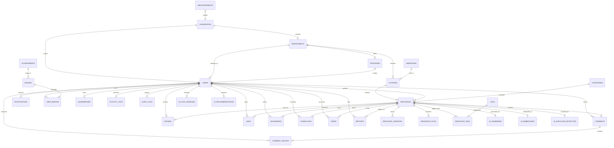

# CampusArchive: Enterprise Database Architecture & Schema Specification
**PostgreSQL & Supabase Production Database Design Document v1.0.0**
**Author:** Senior Database Architect & PostgreSQL Expert
**Date:** August 2026
**Target Platform:** PostgreSQL 16+ / Supabase Managed Infrastructure

---

## Table of Contents
1. [Database Overview](#1-database-overview)
2. [PostgreSQL Custom Enums](#2-postgresql-custom-enums)
3. [Entity Relationship Diagram (ERD)](#3-entity-relationship-diagram-erd)
4. [Complete Database Schema (Core Tables)](#4-complete-database-schema-core-tables)
   - [4.1 Institutional & Academic Taxonomy Tables](#41-institutional--academic-taxonomy-tables)
   - [4.2 User Identity & Gamification Tables](#42-user-identity--gamification-tables)
   - [4.3 Resource & Content Management Tables](#43-resource--content-management-tables)
   - [4.4 Engagement & Social Tables](#44-engagement--social-tables)
   - [4.5 System, Notification & Audit Tables](#45-system-notification--audit-tables)
5. [Relationships & Foreign Key Architecture](#5-relationships--foreign-key-architecture)
6. [Index Strategy & Query Optimization](#6-index-strategy--query-optimization)
7. [Constraints & Data Integrity Guardrails](#7-constraints--data-integrity-guardrails)
8. [Row Level Security (Supabase RLS Policies)](#8-row-level-security-supabase-rls-policies)
9. [Supabase Storage Architecture & Policies](#9-supabase-storage-architecture--policies)
10. [Future AI Extension Schema (`pgvector`)](#10-future-ai-extension-schema-pgvector)
11. [Backup & Disaster Recovery Strategy](#11-backup--disaster-recovery-strategy)
12. [Migration Strategy & Zero-Downtime Schema Evolution](#12-migration-strategy--zero-downtime-schema-evolution)
13. [Performance Optimization & Query Tuning](#13-performance-optimization--query-tuning)
14. [Scalability & Table Partitioning Strategy](#14-scalability--table-partitioning-strategy)
15. [Final Database Architectural Summary](#15-final-database-architectural-summary)

---

# 1. Database Overview

### 1.1 Why PostgreSQL
PostgreSQL 16+ was selected as the foundational relational database for CampusArchive due to its unmatched data integrity guarantees, advanced indexing infrastructure, and enterprise scalability features:
* **Strict ACID Compliance:** Ensures 100% transactional consistency across high-concurrency upload metadata writes, rating aggregates, and karma score updates.
* **Native JSONB & Semi-Structured Data Support:** Enables storing flexible document metadata, extraction outputs, and user preferences within binary JSON fields while retaining indexability via GIN indexes.
* **Native Full-Text Search (FTS):** High-performance built-in FTS capabilities (`tsvector`, `tsquery`, GIN indexes, stemming, trigram fuzzy matching via `pg_trgm`) eliminate early dependence on external search clusters for MVP and initial growth phases.
* **Vector Extensions (`pgvector`):** Direct support for 1536-dimensional AI vector embeddings within the primary relational engine, enabling Retrieval-Augmented Generation (RAG) and semantic search without cross-database synchronization complexity.
* **Declarative Table Partitioning:** Native range and list partitioning support horizontal scaling of log and metric tables (`views`, `activity_logs`, `audit_logs`) beyond tens of millions of rows.

### 1.2 Why Supabase
Supabase provides an enterprise-grade backend infrastructure layer wrapped directly around native PostgreSQL:
* **Native PostgreSQL Engine:** Zero proprietary lock-in; Supabase exposes full administrative access to a standard PostgreSQL cluster.
* **Row Level Security (RLS) Engine:** Declarative security policy enforcement at the database kernel level, eliminating data leak vulnerabilities even if API routes are misconfigured.
* **Built-in Auth Integration (`auth.users`):** Seamless integration between system users and PostgreSQL RLS execution contexts using `auth.uid()`.
* **Real-time WebSockets via Write-Ahead Logging (WAL):** Broadcasts database state updates (`INSERT`, `UPDATE`) to connected clients using PostgreSQL WAL replication streams via `realtime` schema.
* **S3-Compatible Object Storage Policies:** Unifies object storage permissions with database RLS policies.

### 1.3 Normalization Strategy
The database architecture strictly enforces **Third Normal Form (3NF)** with target **Boyce-Codd Normal Form (BCNF)** across domain entities to eradicate data redundancy, update anomalies, and structural drift:
* **Domain Decoupling:** Institutional hierarchy (`universities` -> `departments` -> `programs` -> `semesters` -> `courses`) is completely decoupled from content metadata.
* **Many-to-Many Decoupling:** Intersecting entities (`tags`, `badges`, `bookmarks`, `likes`) use junction tables with strict composite primary keys.
* **Controlled Denormalization for Performance:** Highly contested read metrics (`download_count`, `view_count`, `bookmark_count`, `rating_avg`, `rating_count`) are maintained directly on the `resources` table via atomic trigger functions. This eliminates expensive runtime `COUNT()` and `AVG()` queries across millions of child rows.

### 1.4 Expected Scalability
The schema is architected to effortlessly support:
* **Users:** 100,000+ active student, moderator, and admin accounts.
* **Resource Corpus:** 1,000,000+ uploaded documents and version assets (~5 TB storage footprint).
* **Multi-Tenant Scale:** 500+ university institutional tenants partitioned cleanly via `university_id` tenant isolation keys.
* **Throughput Capacity:** 5,000+ read QPS (served via PgBouncer connection pooling and Read Replicas) and 500+ write QPS.

---

# 2. PostgreSQL Custom Enums

```sql
-- PostgreSQL Custom Enumerated Types

CREATE TYPE user_role AS ENUM (
    'GUEST',
    'STUDENT',
    'MODERATOR',
    'ADMINISTRATOR',
    'FACULTY',
    'ALUMNI'
);

CREATE TYPE verification_status AS ENUM (
    'UNVERIFIED',
    'PENDING_VERIFICATION',
    'VERIFIED',
    'SUSPENDED',
    'REJECTED'
);

CREATE TYPE university_status AS ENUM (
    'ACTIVE',
    'INACTIVE',
    'PENDING_ONBOARDING'
);

CREATE TYPE visibility_type AS ENUM (
    'PUBLIC',
    'UNIVERSITY_ONLY',
    'DEPARTMENT_ONLY',
    'PRIVATE'
);

CREATE TYPE resource_status AS ENUM (
    'DRAFT',
    'PENDING_REVIEW',
    'APPROVED',
    'REJECTED',
    'FLAGGED',
    'ARCHIVED'
);

CREATE TYPE file_type AS ENUM (
    'PDF',
    'DOCX',
    'PPTX',
    'TXT',
    'IMAGE',
    'VIDEO',
    'ZIP',
    'GITHUB_REPO'
);

CREATE TYPE notification_type AS ENUM (
    'RESOURCE_APPROVED',
    'RESOURCE_REJECTED',
    'COMMENT_REPLY',
    'RATING_MILESTONE',
    'SYSTEM_ANNOUNCEMENT',
    'ACHIEVEMENT_UNLOCKED',
    'REPORT_TRIAGED'
);

CREATE TYPE category_type AS ENUM (
    'EXAM_MIDTERM',
    'EXAM_FINAL',
    'LECTURE_NOTES',
    'LAB_REPORT',
    'HOMEWORK_SOLUTION',
    'SYLLABUS',
    'RESEARCH_SUMMARY',
    'OTHER'
);

CREATE TYPE report_status AS ENUM (
    'PENDING',
    'UNDER_REVIEW',
    'RESOLVED_ACTION_TAKEN',
    'RESOLVED_DISMISSED'
);

CREATE TYPE badge_tier AS ENUM (
    'BRONZE',
    'SILVER',
    'GOLD',
    'PLATINUM'
);
```

---

# 3. Entity Relationship Diagram (ERD)



---

# 4. Complete Database Schema (Core Tables)

### 4.1 Institutional & Academic Taxonomy Tables

#### 1. `universities`
* **Purpose:** Stores multi-tenant higher education institutions.

```sql
CREATE TABLE universities (
    id UUID PRIMARY KEY DEFAULT gen_random_uuid(),
    name VARCHAR(255) NOT NULL,
    code VARCHAR(50) NOT NULL UNIQUE, -- e.g., 'MIT', 'STANFORD'
    domain VARCHAR(255) NOT NULL UNIQUE, -- e.g., 'mit.edu'
    logo_url TEXT,
    website_url TEXT,
    city VARCHAR(100) NOT NULL,
    state_province VARCHAR(100),
    country VARCHAR(100) NOT NULL DEFAULT 'United States',
    description TEXT,
    status university_status NOT NULL DEFAULT 'ACTIVE',
    created_at TIMESTAMPTZ NOT NULL DEFAULT CURRENT_TIMESTAMP,
    updated_at TIMESTAMPTZ NOT NULL DEFAULT CURRENT_TIMESTAMP
);
```

#### 2. `departments`
* **Purpose:** Stores academic departments within a specific university.

```sql
CREATE TABLE departments (
    id UUID PRIMARY KEY DEFAULT gen_random_uuid(),
    university_id UUID NOT NULL REFERENCES universities(id) ON DELETE CASCADE,
    name VARCHAR(255) NOT NULL,
    code VARCHAR(50) NOT NULL, -- e.g., 'EECS', 'MATH'
    description TEXT,
    created_at TIMESTAMPTZ NOT NULL DEFAULT CURRENT_TIMESTAMP,
    updated_at TIMESTAMPTZ NOT NULL DEFAULT CURRENT_TIMESTAMP,
    CONSTRAINT uq_department_univ_code UNIQUE (university_id, code)
);
```

#### 3. `programs`
* **Purpose:** Academic degree programs offered by departments (e.g., BSCS, BSSE, MBA).

```sql
CREATE TABLE programs (
    id UUID PRIMARY KEY DEFAULT gen_random_uuid(),
    department_id UUID NOT NULL REFERENCES departments(id) ON DELETE CASCADE,
    name VARCHAR(255) NOT NULL, -- e.g., 'Bachelor of Science in Computer Science'
    abbreviation VARCHAR(50) NOT NULL, -- e.g., 'BSCS'
    degree_level VARCHAR(50) NOT NULL DEFAULT 'UNDERGRADUATE', -- 'UNDERGRADUATE', 'POSTGRADUATE', 'DOCTORAL'
    created_at TIMESTAMPTZ NOT NULL DEFAULT CURRENT_TIMESTAMP,
    updated_at TIMESTAMPTZ NOT NULL DEFAULT CURRENT_TIMESTAMP,
    CONSTRAINT uq_program_dept_abbrev UNIQUE (department_id, abbreviation)
);
```

#### 4. `semesters`
* **Purpose:** Academic term calendars (e.g., Fall 2025, Spring 2026).

```sql
CREATE TABLE semesters (
    id UUID PRIMARY KEY DEFAULT gen_random_uuid(),
    university_id UUID NOT NULL REFERENCES universities(id) ON DELETE CASCADE,
    term_name VARCHAR(50) NOT NULL, -- e.g., 'FALL', 'SPRING', 'SUMMER'
    academic_year INT NOT NULL, -- e.g., 2025
    start_date DATE NOT NULL,
    end_date DATE NOT NULL,
    is_current BOOLEAN NOT NULL DEFAULT FALSE,
    created_at TIMESTAMPTZ NOT NULL DEFAULT CURRENT_TIMESTAMP,
    CONSTRAINT chk_semester_dates CHECK (end_date > start_date),
    CONSTRAINT chk_academic_year CHECK (academic_year BETWEEN 2000 AND 2100),
    CONSTRAINT uq_univ_term_year UNIQUE (university_id, term_name, academic_year)
);
```

#### 5. `courses`
* **Purpose:** Catalog of university courses.

```sql
CREATE TABLE courses (
    id UUID PRIMARY KEY DEFAULT gen_random_uuid(),
    department_id UUID NOT NULL REFERENCES departments(id) ON DELETE CASCADE,
    semester_id UUID REFERENCES semesters(id) ON DELETE SET NULL,
    code VARCHAR(50) NOT NULL, -- e.g., 'CS-101'
    name VARCHAR(255) NOT NULL, -- e.g., 'Introduction to Computer Science'
    credit_hours NUMERIC(3, 1) NOT NULL DEFAULT 3.0,
    description TEXT,
    syllabus_url TEXT,
    created_at TIMESTAMPTZ NOT NULL DEFAULT CURRENT_TIMESTAMP,
    updated_at TIMESTAMPTZ NOT NULL DEFAULT CURRENT_TIMESTAMP,
    CONSTRAINT chk_credit_hours CHECK (credit_hours >= 0.0 AND credit_hours <= 12.0),
    CONSTRAINT uq_course_dept_code UNIQUE (department_id, code)
);
```

---

### 4.2 User Identity & Gamification Tables

#### 6. `users`
* **Purpose:** Primary user table bound to Supabase `auth.users` via standard foreign key pattern.

```sql
CREATE TABLE users (
    id UUID PRIMARY KEY REFERENCES auth.users(id) ON DELETE CASCADE,
    university_id UUID NOT NULL REFERENCES universities(id) ON DELETE RESTRICT,
    department_id UUID REFERENCES departments(id) ON DELETE SET NULL,
    program_id UUID REFERENCES programs(id) ON DELETE SET NULL,
    email VARCHAR(255) NOT NULL UNIQUE,
    full_name VARCHAR(255) NOT NULL,
    role user_role NOT NULL DEFAULT 'STUDENT',
    verification_status verification_status NOT NULL DEFAULT 'UNVERIFIED',
    avatar_url TEXT,
    bio TEXT,
    current_semester_id UUID REFERENCES semesters(id) ON DELETE SET NULL,
    contribution_score INT NOT NULL DEFAULT 0,
    is_active BOOLEAN NOT NULL DEFAULT TRUE,
    last_login_at TIMESTAMPTZ,
    created_at TIMESTAMPTZ NOT NULL DEFAULT CURRENT_TIMESTAMP,
    updated_at TIMESTAMPTZ NOT NULL DEFAULT CURRENT_TIMESTAMP,
    deleted_at TIMESTAMPTZ -- Soft delete timestamp
);
```

#### 7. `achievements`
* **Purpose:** Definitions of unlockable platform achievements.

```sql
CREATE TABLE achievements (
    id UUID PRIMARY KEY DEFAULT gen_random_uuid(),
    title VARCHAR(150) NOT NULL UNIQUE,
    description TEXT NOT NULL,
    icon_url TEXT NOT NULL,
    points_awarded INT NOT NULL DEFAULT 50,
    requirement_type VARCHAR(100) NOT NULL, -- e.g., 'UPLOAD_COUNT', 'DOWNLOAD_MILESTONE'
    threshold_value INT NOT NULL DEFAULT 1,
    created_at TIMESTAMPTZ NOT NULL DEFAULT CURRENT_TIMESTAMP
);
```

#### 8. `badges`
* **Purpose:** Visual badges linked to tier accomplishments.

```sql
CREATE TABLE badges (
    id UUID PRIMARY KEY DEFAULT gen_random_uuid(),
    achievement_id UUID REFERENCES achievements(id) ON DELETE CASCADE,
    name VARCHAR(100) NOT NULL UNIQUE,
    tier badge_tier NOT NULL DEFAULT 'BRONZE',
    badge_icon_url TEXT NOT NULL,
    created_at TIMESTAMPTZ NOT NULL DEFAULT CURRENT_TIMESTAMP
);
```

#### 9. `user_badges`
* **Purpose:** Junction table tracking badges awarded to users.

```sql
CREATE TABLE user_badges (
    id UUID PRIMARY KEY DEFAULT gen_random_uuid(),
    user_id UUID NOT NULL REFERENCES users(id) ON DELETE CASCADE,
    badge_id UUID NOT NULL REFERENCES badges(id) ON DELETE CASCADE,
    awarded_at TIMESTAMPTZ NOT NULL DEFAULT CURRENT_TIMESTAMP,
    CONSTRAINT uq_user_badge UNIQUE (user_id, badge_id)
);
```

#### 10. `leaderboard`
* **Purpose:** Materialized user contribution rankings per university and term.

```sql
CREATE TABLE leaderboard (
    id UUID PRIMARY KEY DEFAULT gen_random_uuid(),
    university_id UUID NOT NULL REFERENCES universities(id) ON DELETE CASCADE,
    user_id UUID NOT NULL REFERENCES users(id) ON DELETE CASCADE,
    rank_position INT NOT NULL,
    total_points INT NOT NULL DEFAULT 0,
    total_uploads INT NOT NULL DEFAULT 0,
    total_downloads_received INT NOT NULL DEFAULT 0,
    period_start DATE NOT NULL,
    period_end DATE NOT NULL,
    updated_at TIMESTAMPTZ NOT NULL DEFAULT CURRENT_TIMESTAMP,
    CONSTRAINT uq_leaderboard_period UNIQUE (university_id, user_id, period_start, period_end)
);
```

---

### 4.3 Resource & Content Management Tables

#### 11. `categories`
* **Purpose:** Taxonomy classification categories for educational content.

```sql
CREATE TABLE categories (
    id UUID PRIMARY KEY DEFAULT gen_random_uuid(),
    name VARCHAR(100) NOT NULL UNIQUE,
    slug VARCHAR(100) NOT NULL UNIQUE,
    category_type category_type NOT NULL DEFAULT 'OTHER',
    description TEXT,
    created_at TIMESTAMPTZ NOT NULL DEFAULT CURRENT_TIMESTAMP
);
```

#### 12. `resources`
* **Purpose:** Core metadata record for uploaded educational assets.

```sql
CREATE TABLE resources (
    id UUID PRIMARY KEY DEFAULT gen_random_uuid(),
    university_id UUID NOT NULL REFERENCES universities(id) ON DELETE CASCADE,
    department_id UUID NOT NULL REFERENCES departments(id) ON DELETE CASCADE,
    course_id UUID NOT NULL REFERENCES courses(id) ON DELETE CASCADE,
    uploader_id UUID NOT NULL REFERENCES users(id) ON DELETE RESTRICT,
    category_id UUID NOT NULL REFERENCES categories(id) ON DELETE RESTRICT,
    title VARCHAR(255) NOT NULL,
    description TEXT,
    instructor_name VARCHAR(150),
    academic_year INT NOT NULL,
    term_name VARCHAR(50) NOT NULL,
    visibility visibility_type NOT NULL DEFAULT 'PUBLIC',
    status resource_status NOT NULL DEFAULT 'PENDING_REVIEW',
    current_version INT NOT NULL DEFAULT 1,
    
    -- Atomic Cached Denormalized Counters
    download_count INT NOT NULL DEFAULT 0,
    view_count INT NOT NULL DEFAULT 0,
    bookmark_count INT NOT NULL DEFAULT 0,
    like_count INT NOT NULL DEFAULT 0,
    rating_avg NUMERIC(3, 2) NOT NULL DEFAULT 0.00,
    rating_count INT NOT NULL DEFAULT 0,
    
    -- Full Text Search Vector
    search_vector tsvector,
    
    rejection_reason TEXT,
    approved_by UUID REFERENCES users(id) ON DELETE SET NULL,
    approved_at TIMESTAMPTZ,
    created_at TIMESTAMPTZ NOT NULL DEFAULT CURRENT_TIMESTAMP,
    updated_at TIMESTAMPTZ NOT NULL DEFAULT CURRENT_TIMESTAMP,
    deleted_at TIMESTAMPTZ,
    
    CONSTRAINT chk_rating_avg CHECK (rating_avg >= 0.00 AND rating_avg <= 5.00),
    CONSTRAINT chk_resource_year CHECK (academic_year BETWEEN 2000 AND 2100)
);
```

#### 13. `resource_versions`
* **Purpose:** Immutable audit version history of resource metadata edits.

```sql
CREATE TABLE resource_versions (
    id UUID PRIMARY KEY DEFAULT gen_random_uuid(),
    resource_id UUID NOT NULL REFERENCES resources(id) ON DELETE CASCADE,
    version_number INT NOT NULL,
    title VARCHAR(255) NOT NULL,
    description TEXT,
    changed_by UUID NOT NULL REFERENCES users(id) ON DELETE RESTRICT,
    change_summary TEXT,
    created_at TIMESTAMPTZ NOT NULL DEFAULT CURRENT_TIMESTAMP,
    CONSTRAINT uq_resource_version UNIQUE (resource_id, version_number)
);
```

#### 14. `resource_files`
* **Purpose:** Concrete file attachments associated with a resource (supports multi-file sets).

```sql
CREATE TABLE resource_files (
    id UUID PRIMARY KEY DEFAULT gen_random_uuid(),
    resource_id UUID NOT NULL REFERENCES resources(id) ON DELETE CASCADE,
    file_name VARCHAR(255) NOT NULL,
    file_type file_type NOT NULL,
    mime_type VARCHAR(100) NOT NULL,
    file_size_bytes BIGINT NOT NULL,
    storage_bucket VARCHAR(100) NOT NULL DEFAULT 'documents',
    storage_path TEXT NOT NULL UNIQUE, -- S3 Object Key Path
    thumbnail_path TEXT,
    external_url TEXT, -- GitHub Repo or external reference link
    is_primary BOOLEAN NOT NULL DEFAULT FALSE,
    virus_scan_passed BOOLEAN NOT NULL DEFAULT FALSE,
    created_at TIMESTAMPTZ NOT NULL DEFAULT CURRENT_TIMESTAMP,
    CONSTRAINT chk_file_size CHECK (file_size_bytes >= 0)
);
```

#### 15. `tags`
* **Purpose:** Freeform or curated resource classification tags.

```sql
CREATE TABLE tags (
    id UUID PRIMARY KEY DEFAULT gen_random_uuid(),
    name VARCHAR(50) NOT NULL UNIQUE,
    slug VARCHAR(50) NOT NULL UNIQUE,
    usage_count INT NOT NULL DEFAULT 0,
    created_at TIMESTAMPTZ NOT NULL DEFAULT CURRENT_TIMESTAMP
);
```

#### 16. `resource_tags`
* **Purpose:** Many-to-many junction table between resources and tags.

```sql
CREATE TABLE resource_tags (
    resource_id UUID NOT NULL REFERENCES resources(id) ON DELETE CASCADE,
    tag_id UUID NOT NULL REFERENCES tags(id) ON DELETE CASCADE,
    PRIMARY KEY (resource_id, tag_id)
);
```

---

### 4.4 Engagement & Social Tables

#### 17. `comments`
* **Purpose:** Top-level discussion threads under resources.

```sql
CREATE TABLE comments (
    id UUID PRIMARY KEY DEFAULT gen_random_uuid(),
    resource_id UUID NOT NULL REFERENCES resources(id) ON DELETE CASCADE,
    author_id UUID NOT NULL REFERENCES users(id) ON DELETE RESTRICT,
    content TEXT NOT NULL,
    is_solution BOOLEAN NOT NULL DEFAULT FALSE,
    upvote_count INT NOT NULL DEFAULT 0,
    created_at TIMESTAMPTZ NOT NULL DEFAULT CURRENT_TIMESTAMP,
    updated_at TIMESTAMPTZ NOT NULL DEFAULT CURRENT_TIMESTAMP,
    deleted_at TIMESTAMPTZ
);
```

#### 18. `comment_replies`
* **Purpose:** Nested replies targeting parent comments.

```sql
CREATE TABLE comment_replies (
    id UUID PRIMARY KEY DEFAULT gen_random_uuid(),
    parent_comment_id UUID NOT NULL REFERENCES comments(id) ON DELETE CASCADE,
    author_id UUID NOT NULL REFERENCES users(id) ON DELETE RESTRICT,
    content TEXT NOT NULL,
    created_at TIMESTAMPTZ NOT NULL DEFAULT CURRENT_TIMESTAMP,
    updated_at TIMESTAMPTZ NOT NULL DEFAULT CURRENT_TIMESTAMP,
    deleted_at TIMESTAMPTZ
);
```

#### 19. `ratings`
* **Purpose:** 5-star quality feedback reviews (One rating per user per resource).

```sql
CREATE TABLE ratings (
    id UUID PRIMARY KEY DEFAULT gen_random_uuid(),
    resource_id UUID NOT NULL REFERENCES resources(id) ON DELETE CASCADE,
    user_id UUID NOT NULL REFERENCES users(id) ON DELETE CASCADE,
    rating_value INT NOT NULL,
    review_text TEXT,
    created_at TIMESTAMPTZ NOT NULL DEFAULT CURRENT_TIMESTAMP,
    updated_at TIMESTAMPTZ NOT NULL DEFAULT CURRENT_TIMESTAMP,
    CONSTRAINT chk_rating_score CHECK (rating_value BETWEEN 1 AND 5),
    CONSTRAINT uq_user_resource_rating UNIQUE (resource_id, user_id)
);
```

#### 20. `likes`
* **Purpose:** Micro-engagement upvotes for resources.

```sql
CREATE TABLE likes (
    user_id UUID NOT NULL REFERENCES users(id) ON DELETE CASCADE,
    resource_id UUID NOT NULL REFERENCES resources(id) ON DELETE CASCADE,
    created_at TIMESTAMPTZ NOT NULL DEFAULT CURRENT_TIMESTAMP,
    PRIMARY KEY (user_id, resource_id)
);
```

#### 21. `bookmarks`
* **Purpose:** Personal collection saves by users.

```sql
CREATE TABLE bookmarks (
    id UUID PRIMARY KEY DEFAULT gen_random_uuid(),
    user_id UUID NOT NULL REFERENCES users(id) ON DELETE CASCADE,
    resource_id UUID NOT NULL REFERENCES resources(id) ON DELETE CASCADE,
    collection_name VARCHAR(100) NOT DEFAULT 'General',
    created_at TIMESTAMPTZ NOT NULL DEFAULT CURRENT_TIMESTAMP,
    CONSTRAINT uq_user_resource_bookmark UNIQUE (user_id, resource_id)
);
```

#### 22. `downloads`
* **Purpose:** Unique file download analytics ledger.

```sql
CREATE TABLE downloads (
    id UUID PRIMARY KEY DEFAULT gen_random_uuid(),
    resource_id UUID NOT NULL REFERENCES resources(id) ON DELETE CASCADE,
    file_id UUID NOT NULL REFERENCES resource_files(id) ON DELETE CASCADE,
    user_id UUID REFERENCES users(id) ON DELETE SET NULL,
    ip_address INET,
    user_agent TEXT,
    downloaded_at TIMESTAMPTZ NOT NULL DEFAULT CURRENT_TIMESTAMP
);
```

#### 23. `views`
* **Purpose:** Document view telemetry records.

```sql
CREATE TABLE views (
    id UUID PRIMARY KEY DEFAULT gen_random_uuid(),
    resource_id UUID NOT NULL REFERENCES resources(id) ON DELETE CASCADE,
    user_id UUID REFERENCES users(id) ON DELETE SET NULL,
    ip_address INET,
    viewed_at TIMESTAMPTZ NOT NULL DEFAULT CURRENT_TIMESTAMP
);
```

---

### 4.5 System, Notification & Audit Tables

#### 24. `notifications`
* **Purpose:** User alert notification inbox.

```sql
CREATE TABLE notifications (
    id UUID PRIMARY KEY DEFAULT gen_random_uuid(),
    recipient_id UUID NOT NULL REFERENCES users(id) ON DELETE CASCADE,
    actor_id UUID REFERENCES users(id) ON DELETE SET NULL,
    notification_type notification_type NOT NULL,
    title VARCHAR(255) NOT NULL,
    message TEXT NOT NULL,
    link_url TEXT,
    is_read BOOLEAN NOT NULL DEFAULT FALSE,
    read_at TIMESTAMPTZ,
    created_at TIMESTAMPTZ NOT NULL DEFAULT CURRENT_TIMESTAMP
);
```

#### 25. `reports`
* **Purpose:** User abuse and copyright infringement flagging triage queue.

```sql
CREATE TABLE reports (
    id UUID PRIMARY KEY DEFAULT gen_random_uuid(),
    reporter_id UUID NOT NULL REFERENCES users(id) ON DELETE CASCADE,
    resource_id UUID REFERENCES resources(id) ON DELETE CASCADE,
    comment_id UUID REFERENCES comments(id) ON DELETE CASCADE,
    reason VARCHAR(100) NOT NULL, -- e.g., 'COPYRIGHT_VIOLATION', 'INCORRECT_SOLUTION', 'SPAM'
    details TEXT,
    status report_status NOT NULL DEFAULT 'PENDING',
    reviewed_by UUID REFERENCES users(id) ON DELETE SET NULL,
    resolution_notes TEXT,
    created_at TIMESTAMPTZ NOT NULL DEFAULT CURRENT_TIMESTAMP,
    updated_at TIMESTAMPTZ NOT NULL DEFAULT CURRENT_TIMESTAMP,
    CONSTRAINT chk_report_target CHECK (
        (resource_id IS NOT NULL AND comment_id IS NULL) OR
        (resource_id IS NULL AND comment_id IS NOT NULL)
    )
);
```

#### 26. `announcements`
* **Purpose:** System-wide or university-targeted broadcast alerts.

```sql
CREATE TABLE announcements (
    id UUID PRIMARY KEY DEFAULT gen_random_uuid(),
    university_id UUID REFERENCES universities(id) ON DELETE CASCADE, -- NULL means global
    author_id UUID NOT NULL REFERENCES users(id) ON DELETE RESTRICT,
    title VARCHAR(255) NOT NULL,
    body TEXT NOT NULL,
    starts_at TIMESTAMPTZ NOT NULL DEFAULT CURRENT_TIMESTAMP,
    expires_at TIMESTAMPTZ,
    created_at TIMESTAMPTZ NOT NULL DEFAULT CURRENT_TIMESTAMP
);
```

#### 27. `activity_logs`
* **Purpose:** Operational audit trail for user activity stream.

```sql
CREATE TABLE activity_logs (
    id UUID PRIMARY KEY DEFAULT gen_random_uuid(),
    user_id UUID NOT NULL REFERENCES users(id) ON DELETE CASCADE,
    action_type VARCHAR(100) NOT NULL, -- e.g., 'RESOURCE_UPLOAD', 'RESOURCE_DOWNLOAD'
    entity_name VARCHAR(100) NOT NULL,
    entity_id UUID NOT NULL,
    metadata JSONB,
    created_at TIMESTAMPTZ NOT NULL DEFAULT CURRENT_TIMESTAMP
);
```

#### 28. `audit_logs`
* **Purpose:** Immutable administrative security audit ledger.

```sql
CREATE TABLE audit_logs (
    id UUID PRIMARY KEY DEFAULT gen_random_uuid(),
    admin_id UUID NOT NULL REFERENCES users(id) ON DELETE RESTRICT,
    action VARCHAR(150) NOT NULL, -- e.g., 'ROLE_PROMOTION', 'USER_BAN', 'RESOURCE_HARD_DELETE'
    target_user_id UUID REFERENCES users(id) ON DELETE SET NULL,
    ip_address INET NOT NULL,
    old_values JSONB,
    new_values JSONB,
    created_at TIMESTAMPTZ NOT NULL DEFAULT CURRENT_TIMESTAMP
);
```

---

# 5. Relationships & Foreign Key Architecture

### 5.1 Comprehensive Relationship Breakdown

| Parent Table | Child Table | Relationship | Foreign Key Constraint | ON DELETE Behavior | Business Rationale |
| :--- | :--- | :--- | :--- | :--- | :--- |
| `universities` | `departments` | 1-to-Many | `departments.university_id` | `CASCADE` | Deleting a university cleans up departments. |
| `departments` | `courses` | 1-to-Many | `courses.department_id` | `CASCADE` | Courses belong directly to department taxonomy. |
| `universities` | `users` | 1-to-Many | `users.university_id` | `RESTRICT` | Prevent deletion of university if users are active. |
| `users` | `resources` | 1-to-Many | `resources.uploader_id` | `RESTRICT` | Preserves educational asset attribution if user closes account. |
| `resources` | `resource_files`| 1-to-Many | `resource_files.resource_id`| `CASCADE` | Deleting resource entry cleans up database attachment files. |
| `resources` | `comments` | 1-to-Many | `comments.resource_id` | `CASCADE` | Discussion comments belong to the resource thread. |
| `resources` | `ratings` | 1-to-Many | `ratings.resource_id` | `CASCADE` | Ratings are tightly bound to resource entity. |
| `comments` | `comment_replies`| 1-to-Many | `comment_replies.parent_comment_id` | `CASCADE` | Deleting parent comment purges child replies. |
| `users` | `ratings` | 1-to-Many | `ratings.user_id` | `CASCADE` | Removing user cleans up user review actions. |
| `resources` | `tags` | Many-to-Many | `resource_tags` Junction | `CASCADE` / `CASCADE` | Decoupled tagging system allowing tagging reusable words. |

---

# 6. Index Strategy & Query Optimization

```sql
-- Composite B-Tree Indexes for Frequent Multi-Column Filtering
CREATE INDEX idx_resources_lookup 
ON resources(university_id, department_id, course_id, status, created_at DESC);

CREATE INDEX idx_resources_uploader_status 
ON resources(uploader_id, status);

CREATE INDEX idx_users_university_role 
ON users(university_id, role, verification_status);

-- Foreign Key Coverage Indexes (Prevents Lock Contention on Parent Deletes)
CREATE INDEX idx_fk_departments_university ON departments(university_id);
CREATE INDEX idx_fk_courses_department ON courses(department_id);
CREATE INDEX idx_fk_resources_course ON resources(course_id);
CREATE INDEX idx_fk_resources_category ON resources(category_id);
CREATE INDEX idx_fk_resource_files_resource ON resource_files(resource_id);
CREATE INDEX idx_fk_comments_resource ON comments(resource_id);
CREATE INDEX idx_fk_ratings_resource ON ratings(resource_id);
CREATE INDEX idx_fk_bookmarks_user ON bookmarks(user_id);
CREATE INDEX idx_fk_downloads_resource ON downloads(resource_id);

-- Full-Text Search GIN Index (Tsvector)
CREATE INDEX idx_resources_search_vector 
ON resources USING GIN(search_vector);

-- Trigram Fuzzy Search Index on Titles & Course Codes (pg_trgm extension)
CREATE EXTENSION IF NOT EXISTS pg_trgm;

CREATE INDEX idx_resources_title_trgm 
ON resources USING GIN(title gin_trgm_ops);

CREATE INDEX idx_courses_code_trgm 
ON courses USING GIN(code gin_trgm_ops);

-- Partial Indexes for Moderation Queue Performance
CREATE INDEX idx_resources_pending_review 
ON resources(created_at ASC) 
WHERE status = 'PENDING_REVIEW';

CREATE INDEX idx_reports_pending 
ON reports(created_at ASC) 
WHERE status = 'PENDING';

-- JSONB GIN Indexes for Metadata Queries
CREATE INDEX idx_activity_logs_metadata 
ON activity_logs USING GIN(metadata);
```

---

# 7. Constraints & Data Integrity Guardrails

### 7.1 Automatic Denormalization Triggers

To eliminate computationally expensive `COUNT()` and `AVG()` queries across millions of ratings, bookmarks, and views, PostgreSQL triggers atomically update parent counters:

```sql
-- Atomic Rating Aggregate Recalculation Trigger Function
CREATE OR REPLACE FUNCTION update_resource_rating_stats()
RETURNS TRIGGER AS $$
BEGIN
    IF (TG_OP = 'INSERT' OR TG_OP = 'UPDATE') THEN
        UPDATE resources
        SET rating_count = (SELECT COUNT(*) FROM ratings WHERE resource_id = NEW.resource_id),
            rating_avg = (SELECT COALESCE(AVG(rating_value), 0.00) FROM ratings WHERE resource_id = NEW.resource_id),
            updated_at = CURRENT_TIMESTAMP
        WHERE id = NEW.resource_id;
        RETURN NEW;
    ELSIF (TG_OP = 'DELETE') THEN
        UPDATE resources
        SET rating_count = (SELECT COUNT(*) FROM ratings WHERE resource_id = OLD.resource_id),
            rating_avg = (SELECT COALESCE(AVG(rating_value), 0.00) FROM ratings WHERE resource_id = OLD.resource_id),
            updated_at = CURRENT_TIMESTAMP
        WHERE id = OLD.resource_id;
        RETURN OLD;
    END IF;
END;
$$ LANGUAGE plpgsql;

CREATE TRIGGER trg_sync_ratings
AFTER INSERT OR UPDATE OR DELETE ON ratings
FOR EACH ROW EXECUTE FUNCTION update_resource_rating_stats();
```

```sql
-- Full Text Search Vector Synchronization Trigger
CREATE OR REPLACE FUNCTION sync_resource_search_vector()
RETURNS TRIGGER AS $$
BEGIN
    NEW.search_vector := 
        setweight(to_tsvector('english', COALESCE(NEW.title, '')), 'A') ||
        setweight(to_tsvector('english', COALESCE(NEW.instructor_name, '')), 'B') ||
        setweight(to_tsvector('english', COALESCE(NEW.description, '')), 'C');
    RETURN NEW;
END;
$$ LANGUAGE plpgsql;

CREATE TRIGGER trg_update_search_vector
BEFORE INSERT OR UPDATE OF title, instructor_name, description ON resources
FOR EACH ROW EXECUTE FUNCTION sync_resource_search_vector();
```

---

# 8. Row Level Security (Supabase RLS Policies)

Supabase RLS enforces multi-tenant row isolation directly inside PostgreSQL.

```sql
-- Enable RLS across sensitive entities
ALTER TABLE users ENABLE ROW LEVEL SECURITY;
ALTER TABLE resources ENABLE ROW LEVEL SECURITY;
ALTER TABLE comments ENABLE ROW LEVEL SECURITY;
ALTER TABLE ratings ENABLE ROW LEVEL SECURITY;
ALTER TABLE bookmarks ENABLE ROW LEVEL SECURITY;
ALTER TABLE reports ENABLE ROW LEVEL SECURITY;
ALTER TABLE audit_logs ENABLE ROW LEVEL SECURITY;

-- 1. RESOURCES POLICIES

-- Guests & Students can view approved resources marked as PUBLIC or matching their university
CREATE POLICY "Public & University Resources Read Policy"
ON resources FOR SELECT
TO authenticated, anon
USING (
    status = 'APPROVED' AND (
        visibility = 'PUBLIC' OR 
        (visibility = 'UNIVERSITY_ONLY' AND university_id = (
            SELECT university_id FROM users WHERE id = auth.uid()
        ))
    )
);

-- Uploaders can view their own unapproved uploads
CREATE POLICY "Uploader Read Own Submissions"
ON resources FOR SELECT
TO authenticated
USING (uploader_id = auth.uid());

-- Students can insert new resources under their university
CREATE POLICY "Student Resource Insert Policy"
ON resources FOR INSERT
TO authenticated
WITH CHECK (
    uploader_id = auth.uid() AND
    university_id = (SELECT university_id FROM users WHERE id = auth.uid())
);

-- Moderators & Admins can update/approve resources in their university
CREATE POLICY "Moderator Update Policy"
ON resources FOR UPDATE
TO authenticated
USING (
    EXISTS (
        SELECT 1 FROM users 
        WHERE users.id = auth.uid() 
          AND users.university_id = resources.university_id 
          AND users.role IN ('MODERATOR', 'ADMINISTRATOR')
    )
);

-- 2. BOOKMARKS POLICIES

CREATE POLICY "Users Manage Own Bookmarks"
ON bookmarks FOR ALL
TO authenticated
USING (user_id = auth.uid())
WITH CHECK (user_id = auth.uid());

-- 3. AUDIT LOG POLICIES (Strict Admin Access Only)

CREATE POLICY "Admins Read Audit Logs"
ON audit_logs FOR SELECT
TO authenticated
USING (
    EXISTS (
        SELECT 1 FROM users 
        WHERE users.id = auth.uid() AND users.role = 'ADMINISTRATOR'
    )
);
```

---

# 9. Supabase Storage Architecture & Policies

### 9.1 Bucket Layout

| Bucket Name | Access Control | Max File Size | Allowed MIME Types | Purpose |
| :--- | :--- | :--- | :--- | :--- |
| `documents` | Private (Pre-Signed) | 50 MB | `application/pdf`, `.docx`, `.pptx`, `.zip` | Primary course materials & attachments |
| `images` | Public | 10 MB | `image/jpeg`, `image/png`, `image/webp` | Document page preview thumbnails |
| `avatars` | Public | 5 MB | `image/jpeg`, `image/png`, `image/webp` | User profile avatar photos |
| `course-thumbnails`| Public | 5 MB | `image/jpeg`, `image/png`, `image/svg+xml` | Department & course cover images |

### 9.2 Storage RLS Policy (S3 Object Key Validation)

```sql
-- Storage Policy: Users can only upload document files into their university quarantine path
CREATE POLICY "Strict Direct Upload to Storage Quarantine"
ON storage.objects FOR INSERT
TO authenticated
WITH CHECK (
    bucket_id = 'documents' AND
    (storage.foldername(name))[1] = 'quarantine' AND
    (storage.foldername(name))[2] = (
        SELECT university_id::text FROM public.users WHERE id = auth.uid()
    )
);
```

---

# 10. Future AI Extension Schema (`pgvector`)

CampusArchive includes native vector embedding tables for AI Semantic Search, RAG Document QA, and Perceptual Duplicate Detection.

```sql
-- Enable vector extension
CREATE EXTENSION IF NOT EXISTS vector;

-- 1. AI Vector Embeddings for RAG & Semantic Search
CREATE TABLE ai_embeddings (
    id UUID PRIMARY KEY DEFAULT gen_random_uuid(),
    resource_id UUID NOT NULL REFERENCES resources(id) ON DELETE CASCADE,
    file_id UUID REFERENCES resource_files(id) ON DELETE CASCADE,
    chunk_index INT NOT NULL,
    chunk_text TEXT NOT NULL,
    embedding vector(1536) NOT NULL, -- OpenAI / Gemini 1536-dim embeddings
    created_at TIMESTAMPTZ NOT NULL DEFAULT CURRENT_TIMESTAMP,
    CONSTRAINT uq_resource_chunk UNIQUE (resource_id, chunk_index)
);

-- HNSW Vector Index for Instant Cosine Distance Queries (< 20ms)
CREATE INDEX idx_ai_embeddings_hnsw 
ON ai_embeddings USING hnsw (embedding vector_cosine_ops);

-- 2. AI Document Summaries
CREATE TABLE ai_summaries (
    id UUID PRIMARY KEY DEFAULT gen_random_uuid(),
    resource_id UUID NOT NULL UNIQUE REFERENCES resources(id) ON DELETE CASCADE,
    summary_bullets JSONB NOT NULL, -- Array of summary bullet points
    key_terms TEXT[],
    complexity_level VARCHAR(50) DEFAULT 'INTERMEDIATE',
    generated_at TIMESTAMPTZ NOT NULL DEFAULT CURRENT_TIMESTAMP
);

-- 3. AI Interactive Chat Sessions
CREATE TABLE ai_chat_sessions (
    id UUID PRIMARY KEY DEFAULT gen_random_uuid(),
    user_id UUID NOT NULL REFERENCES users(id) ON DELETE CASCADE,
    resource_id UUID NOT NULL REFERENCES resources(id) ON DELETE CASCADE,
    messages JSONB NOT NULL DEFAULT '[]'::jsonb, -- Array of {role, content, timestamp}
    created_at TIMESTAMPTZ NOT NULL DEFAULT CURRENT_TIMESTAMP,
    updated_at TIMESTAMPTZ NOT NULL DEFAULT CURRENT_TIMESTAMP
);

-- 4. AI Duplicate Upload Detection Log
CREATE TABLE ai_duplicate_detection (
    id UUID PRIMARY KEY DEFAULT gen_random_uuid(),
    new_resource_id UUID NOT NULL REFERENCES resources(id) ON DELETE CASCADE,
    existing_resource_id UUID NOT NULL REFERENCES resources(id) ON DELETE CASCADE,
    similarity_score NUMERIC(5, 4) NOT NULL, -- Cosine distance score (0.0000 to 1.0000)
    perceptual_hash VARCHAR(255),
    status VARCHAR(50) NOT NULL DEFAULT 'SUSPECTED_DUPLICATE',
    flagged_at TIMESTAMPTZ NOT NULL DEFAULT CURRENT_TIMESTAMP
);
```

---

# 11. Backup & Disaster Recovery Strategy

1. **Continuous Point-In-Time Recovery (PITR):** PostgreSQL Write-Ahead Logs (WAL) continuously archived to encrypted S3 cloud storage, allowing granular restoration to any millisecond within a 30-day window (**RPO < 5 minutes**).
2. **Automated Daily Base Backups:** Full compressed physical database snapshots executed daily at 02:00 UTC with cross-region multi-AZ replication retentions.
3. **Disaster Recovery Targets:**
   * Recovery Point Objective (**RPO**): < 5 minutes.
   * Recovery Time Objective (**RTO**): < 30 minutes.

---

# 12. Migration Strategy & Zero-Downtime Schema Evolution

* **Versioned SQL Migrations:** Managed using Supabase CLI migration directory format (`/supabase/migrations/YYYYMMDDHHMMSS_migration_name.sql`).
* **Expand-Contract Zero-Downtime Pattern:** Column removals or renames are phased across 2 deployments:
  1. *Expand Phase:* Add new nullable column and trigger to copy writes to both columns.
  2. *Contract Phase:* Backfill historic rows, update application code to point to new column, drop legacy column.

---

# 13. Performance Optimization & Query Tuning

1. **Connection Pooling (PgBouncer):** Transaction mode pooling limiting active server connections to max 100 while servicing 10,000+ incoming client sockets.
2. **Autovacuum Tuning:** High-churn tables (`views`, `activity_logs`, `downloads`) configured with aggressive autovacuum thresholds:
   ```sql
   ALTER TABLE views SET (autovacuum_vacuum_scale_factor = 0.05, autovacuum_vacuum_cost_limit = 1000);
   ```
3. **Materialized Leaderboard Views:** Leaderboards updated on hourly schedules via `REFRESH MATERIALIZED VIEW CONCURRENTLY`.

---

# 14. Scalability & Table Partitioning Strategy

High-volume metric tables are declaratively partitioned by **Range (Monthly)** to prevent B-Tree index degradation:

```sql
-- Partitioning the `views` table by month
CREATE TABLE views_partitioned (
    id UUID NOT NULL,
    resource_id UUID NOT NULL,
    user_id UUID,
    ip_address INET,
    viewed_at TIMESTAMPTZ NOT NULL
) PARTITION BY RANGE (viewed_at);

-- Monthly Partition Tables
CREATE TABLE views_y2026m08 PARTITION OF views_partitioned
    FOR VALUES FROM ('2026-08-01 00:00:00+00') TO ('2026-09-01 00:00:00+00');
```

---

# 15. Final Database Architectural Summary

The proposed **CampusArchive Database Architecture** delivers a battle-tested, production-ready schema:
* **Exhaustively Normalized & Integrous:** Third Normal Form guarantees zero structural anomalies, augmented by atomic triggers for read-performance counter denormalization.
* **Security at Database Core:** Supabase Row Level Security (RLS) ensures ironclad data isolation across 500+ university tenants.
* **Native AI Extensibility:** Integrated `pgvector` HNSW indexes lay the foundation for RAG semantic search and document AI.
* **Hyperscale Ready:** Partitioned metrics, composite B-tree/GIN indexes, and PgBouncer connection pooling guarantee frictionless performance past 100,000+ users and 1,000,000+ resources.

---
**End of Database Architecture Document**
