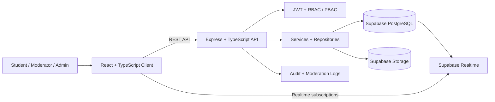
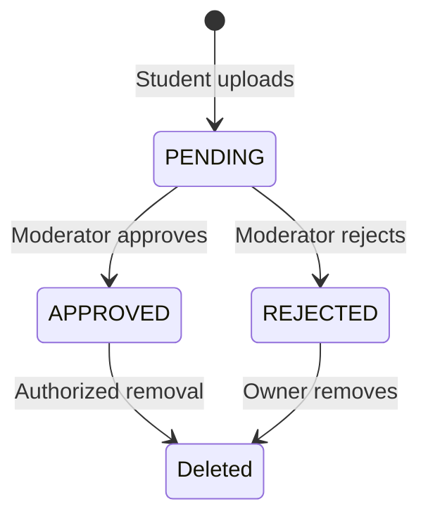

<div align="center">


<br/>

[](#technology-stack)
[](#technology-stack)
[](#technology-stack)
[](#technology-stack)
[](#technology-stack)
[](./.github/workflows/deploy-production.yml)

**A full-stack academic resource platform for turning scattered university material into a structured, moderated, searchable knowledge system.**

</div>

---

## Why CampusArchive exists

Useful academic material often disappears into private chats, personal drives, old devices, and semester-specific groups. Notes, past papers, lab manuals, assignments, books, and project material may exist — but they are difficult to discover, verify, and preserve.

**CampusArchive turns that fragmented content into an organized university knowledge layer.**

Resources live inside a real academic hierarchy, uploads go through moderation, students can search and interact with approved material, and administrators have the operational tooling required to keep the archive useful and trustworthy.

```text
Department
└── Program
    └── Semester
        └── Course
            ├── Chapter
            └── Resource
```

This project is intentionally more than a CRUD dashboard. It combines **content lifecycle management, realtime interaction, moderation, role-based access, analytics, storage, search, and deployment infrastructure** inside one product.

---

## System at a glance



The frontend is not treated as the source of truth. Ratings, comments, likes, bookmarks, downloads, moderation decisions, and analytics are persisted through the backend. Realtime events are used to synchronize connected clients with persisted state.

---

## Product surface

| Area | What the system supports |
|---|---|
| **Discovery** | Department/program/semester/course navigation, Course Hubs, global search, filtering, related resources |
| **Resource lifecycle** | Upload, metadata, storage, moderation queue, approval/rejection, featuring, soft deletion |
| **Student interaction** | Ratings, comments, nested replies, likes, bookmarks, views, downloads, notifications |
| **Trust & moderation** | Pending-review workflow, moderator actions, comment locking, reports, audit logs |
| **Identity & access** | JWT authentication, roles, permissions, account management, suspension/restoration |
| **Contribution system** | Contributor karma, rankings, upload/download metrics, profile activity |
| **Operations** | Analytics dashboards, announcements, moderation tooling, deployment workflow |

---

## Engineering decisions

### 1. Moderation is part of the data model

Uploaded material does not become public immediately. A resource begins in a `PENDING` state and moves through an explicit moderation lifecycle.



This prevents the archive from becoming an unstructured file dump and makes trust a first-class product concern.

### 2. Authorization goes beyond route hiding

The backend uses authenticated server-side checks rather than relying on frontend visibility. Role and permission checks protect operations such as moderation, user administration, announcements, analytics, and destructive actions.

### 3. Realtime is a synchronization mechanism — not state ownership

Supabase Realtime informs clients that persisted interaction data changed. The application then reloads authoritative state rather than maintaining a separate frontend-only truth.

### 4. Academic context is built into retrieval

A resource is connected to structured academic entities instead of existing only as an uploaded file. That enables course-aware discovery and keeps the archive navigable as content grows.

### 5. Administrative actions are observable

Moderation and privileged actions are designed around auditability so that operational changes can be reviewed rather than disappearing into opaque UI state.

---

## Roles and permissions

### Guest
- Browse approved resources.
- Explore the academic hierarchy.
- Search the archive and view public discussions.

### Student
- Upload resources for review.
- Download and bookmark approved material.
- Rate resources and participate in discussions.
- View notifications, upload history, profile data, and contribution metrics.

### Moderator
- Review pending content.
- Approve, reject, feature, or remove resources according to permissions.
- Moderate ratings/comments and lock discussions when required.

### Administrator / Super Administrator
- Manage users, roles, permissions, and account state.
- Access platform analytics and audit history.
- Publish announcements and operate the full administrative surface.

---

## Interaction model

CampusArchive treats interactions as persisted product data rather than decorative UI features.

- One rating per user/resource, with update and delete behavior.
- Nested comments/replies with bounded depth.
- Toggle-based comment likes with uniqueness constraints.
- Persistent bookmarks.
- Download and view tracking.
- Realtime refresh after persisted changes.
- Contributor metrics recalculated from stored activity.

Example contribution signals include approved uploads, ratings received, helpful participation, engagement, and downloads.

---

## Technology stack

| Layer | Technology |
|---|---|
| Frontend | React 18, TypeScript, Vite |
| Styling | Tailwind CSS + custom design system |
| Animation | Framer Motion |
| API | Node.js, Express, TypeScript |
| Validation | Zod |
| Authentication | JWT + bcrypt |
| Database | Supabase PostgreSQL |
| Storage | Supabase Storage |
| Realtime | Supabase Realtime / Postgres Changes |
| Security | Helmet, CORS, rate limiting, sanitization, RLS |
| Architecture | Routes → Middleware → Controllers → Services → Repositories |
| Monorepo | npm workspaces |
| Delivery | GitHub Actions + production deployment workflow |

---

## Repository structure

```text
CampusArchive/
├── frontend/                 # React application
│   └── src/
│       ├── components/
│       ├── context/
│       ├── pages/
│       ├── services/
│       └── types/
│
├── backend/                  # Express API
│   ├── database/             # Schema + migrations + seed material
│   └── src/
│       ├── controllers/
│       ├── middlewares/
│       ├── repositories/
│       ├── routes/
│       ├── services/
│       └── validators/
│
├── shared/                   # Shared roles, permissions, contracts
├── deploy/                   # Deployment assets
├── docs/                     # Supporting technical documentation
├── .github/workflows/        # Delivery automation
└── README.md
```

---

## API shape

Local base URL:

```text
http://localhost:4000/api/v1
```

Protected requests use:

```http
Authorization: Bearer <access-token>
Content-Type: application/json
```

Representative API areas include:

```text
/auth
/academics
/resources
/ratings
/comments
/search
/dashboard
/bookmarks
/notifications
/admin
```

For the extended contract and endpoint catalog, see [`API_SPECIFICATION.md`](./API_SPECIFICATION.md).

---

## Local development

### Prerequisites

- Node.js 20+
- npm 10+
- A Supabase project
- A Supabase Storage bucket named `academic_resources`

### Setup

```bash
git clone https://github.com/usman611b/CampusArchive.git
cd CampusArchive
npm install
```

Configure the required frontend/backend environment variables, install the database schema/migrations, then run the workspace development commands defined in `package.json`.

The repository includes dedicated design and deployment documentation for the deeper setup details.

---

## Documentation map

CampusArchive has intentionally detailed engineering documentation beyond this overview.

| Document | Focus |
|---|---|
| [`PRD.md`](./PRD.md) | Product requirements and product intent |
| [`ARCHITECTURE.md`](./ARCHITECTURE.md) | System architecture and major technical decisions |
| [`BACKEND_DESIGN.md`](./BACKEND_DESIGN.md) | Backend structure and service design |
| [`FRONTEND_DESIGN.md`](./FRONTEND_DESIGN.md) | Frontend architecture and interaction design |
| [`DATABASE_DESIGN.md`](./DATABASE_DESIGN.md) | Data model and relational design |
| [`API_SPECIFICATION.md`](./API_SPECIFICATION.md) | REST API contract |
| [`DEVOPS_DESIGN.md`](./DEVOPS_DESIGN.md) | Delivery and infrastructure design |
| [`DESIGN_GUIDELINES.md`](./DESIGN_GUIDELINES.md) | UI and product design conventions |
| [`ROADMAP.md`](./ROADMAP.md) | Planned evolution |

---

## What this project demonstrates

CampusArchive is evidence of working across the full path of a software system:

**problem framing → product structure → frontend → backend → data model → authentication → permissions → realtime behavior → storage → moderation → observability → deployment**

The important part is not any single framework. It is how those layers are connected into one coherent product.

---

<div align="center">

### Built as a system, not a collection of screens.

**Usman Ali** · [GitHub](https://github.com/usman611b) · [Portfolio](https://www.usmanalii.com/)

</div>
