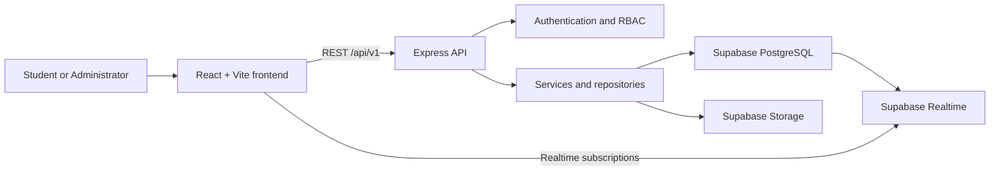
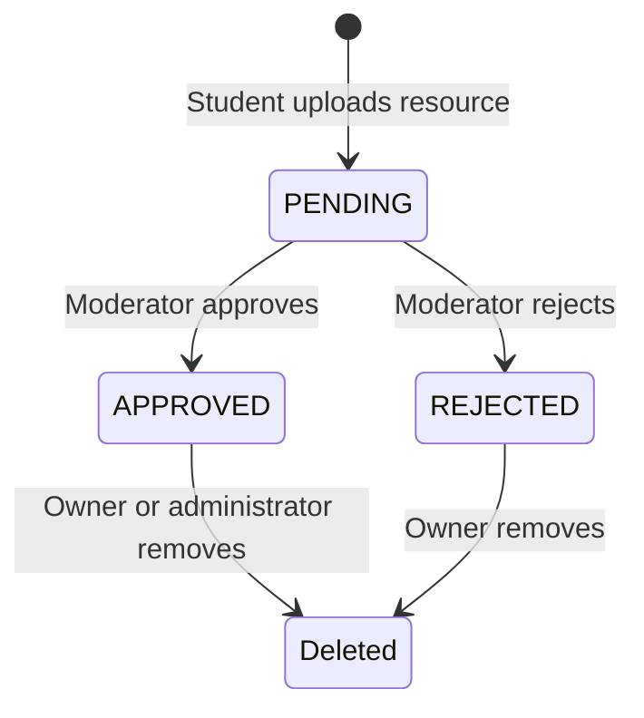

# CampusArchive

> **Preserving Knowledge. Empowering Students.**

CampusArchive is a full-stack academic resource-sharing platform for university communities. It gives students one organized place to discover, upload, review, discuss, bookmark, and download verified academic material while giving moderators and administrators the tools required to keep the archive trustworthy.

The application is built as a TypeScript monorepo using React, Express, and Supabase. It includes an academic hierarchy, resource moderation, realtime interactions, contributor karma, dashboards, notifications, search, bookmarks, audit logs, and role-based administration.

This is helpful for the students 

## Table of contents

- [Product overview](#product-overview)
- [Core features](#core-features)
- [Technology stack](#technology-stack)
- [System architecture](#system-architecture)
- [Roles and permissions](#roles-and-permissions)
- [Resource lifecycle](#resource-lifecycle)
- [Resource interaction system](#resource-interaction-system)
- [Karma and contributor leaderboard](#karma-and-contributor-leaderboard)
- [Database model](#database-model)
- [REST API](#rest-api)
- [Project structure](#project-structure)
- [Local development](#local-development)
- [Supabase setup](#supabase-setup)
- [Environment variables](#environment-variables)
- [Available scripts](#available-scripts)
- [Security](#security)
- [Testing and verification](#testing-and-verification)
- [Deployment](#deployment)
- [Troubleshooting](#troubleshooting)
- [Additional documentation](#additional-documentation)

## Product overview

CampusArchive addresses a common university problem: useful notes, past papers, lab manuals, assignments, books, and project material are scattered across chats, personal drives, and individual student devices. The platform turns that fragmented content into a moderated, searchable, course-aware archive.

Every resource belongs to a structured academic path:

```text
Department
└── Program
    └── Semester
        └── Course
            ├── Chapter (optional)
            └── Resource
```

Students can navigate the hierarchy or use global search. Uploaded content remains pending until approved by a moderator or administrator. Approved resources can then receive ratings, comments, replies, likes, bookmarks, views, and downloads.

## Core features

### Public and student experience

- Responsive landing page with live platform statistics.
- Academic explorer organized by department, program, semester, and course.
- Course Hubs containing categorized resources and course discussions.
- Global resource search with category, department, semester, and sorting filters.
- Resource detail view containing:
  - title and description;
  - uploader information;
  - department, program, course, and semester;
  - category and tags;
  - file type and file size;
  - views and downloads;
  - average rating and rating count;
  - comments, replies, and likes;
  - related approved course resources.
- Secure upload workflow backed by Supabase Storage.
- Personal upload history with moderation status.
- Persistent bookmarks.
- Personal profile and contributor karma.
- User notification center.
- Light and dark themes.

### Resource interactions

- One 1–5 star rating per user and resource.
- Rating updates replace the existing rating.
- Rating deletion.
- Persisted average rating and rating count.
- Comments on approved resources.
- Editing and deleting a user's own comments.
- Moderator and administrator deletion of any comment.
- Replies nested to a maximum of three levels.
- One like per user per comment with toggle behavior.
- Moderator comment locking.
- Supabase Realtime updates without refreshing the page.

### Moderation and administration

- Moderation queue for pending uploads.
- Approve, reject, feature, or remove resources.
- User search and management.
- Role changes and account suspension/restoration.
- Platform analytics.
- Contributor rankings.
- System announcements.
- Audit logs for administrative actions.
- Permission-based access control in addition to role checks.

## Technology stack

| Layer | Technology |
|---|---|
| Frontend | React 18, TypeScript, Vite |
| Styling | Tailwind CSS, custom design system |
| UI animation | Framer Motion |
| Icons | Lucide React |
| HTTP client | Axios |
| Backend | Node.js, Express, TypeScript |
| Validation | Zod |
| Authentication | Application JWT, bcrypt password hashing |
| Database | Supabase PostgreSQL |
| File storage | Supabase Storage |
| Realtime | Supabase Realtime/Postgres Changes |
| Security | Helmet, CORS, rate limiting, HTML sanitization, RLS |
| Caching | NodeCache for dashboard analytics |
| Monorepo | npm workspaces |

## System architecture



The frontend never treats interaction state as the source of truth. Ratings, comments, likes, bookmarks, downloads, and moderation changes are written through the Express API and persisted in Supabase. Realtime events tell connected clients to reload the latest persisted state.

### Backend organization

The Express application follows a layered architecture:

```text
Route → Middleware → Controller → Service → Repository/Supabase
```

- **Routes** define REST endpoints.
- **Authentication middleware** validates JWTs.
- **RBAC/PBAC middleware** enforces roles and permissions.
- **Controllers** parse requests and format responses.
- **Services** implement application rules.
- **Repositories** perform reusable resource data operations.
- **DTO mappers** convert database rows into stable API response shapes.

## Roles and permissions

### Guest

- Browse approved resources.
- View departments, programs, semesters, courses, ratings, and discussions.
- Search the archive.

### Student

- All guest capabilities.
- Upload resources for review.
- Download approved resources.
- Bookmark resources.
- Rate approved resources.
- Add comments and replies.
- Like comments.
- Edit or delete their own comments.
- View personal uploads, profile, notifications, and karma.

### Moderator

- Student capabilities.
- Review and moderate submitted resources.
- Delete inappropriate ratings or comments.
- Lock or unlock resource comments.
- Access permitted analytics and moderation tools.

### Administrator / Super administrator

- Full moderation capabilities.
- Manage users and roles.
- Suspend, restore, or soft-delete accounts according to permission rules.
- Publish announcements.
- Review audit logs.
- Access the complete operations console.

## Resource lifecycle



1. The frontend requests a signed upload URL or sends supported upload data.
2. The file is stored in the `academic_resources` Supabase Storage bucket.
3. The API records metadata, tags, course association, uploader, and checksum/hash.
4. The resource starts in `PENDING` status.
5. Administrators and moderators receive a moderation notification.
6. Approved resources become visible across search, dashboards, Course Hubs, and related-resource results.
7. Rejected and pending resources remain visible to their owner in upload history but cannot receive public interactions.

## Resource interaction system

### Ratings

- Ratings must be integers from 1 through 5.
- `(resource_id, user_id)` is unique.
- `POST /ratings` creates a rating.
- `PATCH /ratings/:id` updates the existing rating.
- `DELETE /ratings/:id` removes it.
- Aggregate values are persisted in `resource_analytics`.
- Rating changes trigger contributor karma recalculation.

### Comments and replies

- Empty and whitespace-only comments are rejected.
- HTML tags are removed and raw angle-bracket input is rejected by validation.
- Content is limited to 2,000 characters.
- Replies reference `parent_comment_id`.
- The API validates the entire parent chain and enforces a maximum depth of three.
- Deletes are soft deletes using `deleted_at`.
- Students may modify their own content; moderators may remove any comment.
- Rapid comment posting is throttled to reduce spam.

### Comment likes

- `(comment_id, user_id)` is unique.
- The like endpoint toggles the current user's like.
- Like counts and current-user state are returned with comments.
- Likes contribute to the comment author's karma.

### Realtime behavior

The frontend subscribes to changes on:

- `resource_ratings`;
- `resource_comments`;
- `comment_likes`.

When a change arrives, the client reloads the persisted interaction state. Resource details remain usable if the interaction migration has not yet been installed, and interaction controls are disabled with a clear migration notice.

## Karma and contributor leaderboard

CampusArchive recalculates contributor metrics from persisted data rather than maintaining frontend-only points.

| Activity | Karma |
|---|---:|
| Approved upload | +50 |
| Rating received | +5 |
| Helpful comment | +10 |
| Comment like received | +2 |
| Resource download | +2 |

Contributor metrics include uploads, downloads, average rating, helpful comments, bookmarks, and total karma. Dashboard and homepage leaderboard data are loaded from the backend and include active platform contributors regardless of their administrative role.

## Database model

The master schema is located at [`backend/database/schema.sql`](backend/database/schema.sql).

Major table groups:

### Academic structure

- `departments`
- `programs`
- `semesters`
- `courses`
- `chapters`
- `categories`
- `tags`
- `resource_tags`

### Users and contribution

- `users`
- `contributor_metrics`
- `notifications`
- `audit_logs`

### Resources and storage

- `resources`
- `storage_metadata`
- `resource_analytics`
- `downloads`
- `views`
- `bookmarks`

### Interactions

- `resource_ratings`
- `resource_comments`
- `comment_likes`

### Moderation

- `reports`
- `moderation_logs`

Foreign keys, unique constraints, validation checks, indexes, and Row Level Security policies are defined in SQL. The backend uses the Supabase service role for trusted server-side writes; that key must never be exposed to the browser.

## REST API

Local base URL:

```text
http://localhost:4000/api/v1
```

Protected routes require:

```http
Authorization: Bearer <access-token>
Content-Type: application/json
```

Successful responses generally use:

```json
{
  "success": true,
  "message": "Operation completed.",
  "data": {}
}
```

### Authentication

| Method | Endpoint | Purpose |
|---|---|---|
| POST | `/auth/register` | Create an account |
| POST | `/auth/login` | Authenticate and receive a JWT |
| GET | `/auth/me` | Fetch the current user |
| PUT | `/auth/profile` | Update the current profile |

Logout is handled client-side by removing the stored application access token.

### Academic hierarchy

| Method | Endpoint | Purpose |
|---|---|---|
| GET | `/academics/departments` | List departments |
| GET | `/academics/departments/:deptId/programs` | List department programs |
| GET | `/academics/programs/:programId/semesters` | List program semesters |
| GET | `/academics/programs/:programId/semesters/:semesterId/courses` | List courses |
| GET | `/academics/courses/:id` | Get Course Hub data |
| GET | `/academics/courses/:courseId/contributors` | Get course contributors |

### Resources

| Method | Endpoint | Purpose |
|---|---|---|
| POST | `/resources/upload-url` | Request a signed storage upload URL |
| POST | `/resources` | Create a pending resource record |
| GET | `/resources/my-uploads` | Get the current user's uploads |
| GET | `/resources/course/:courseId` | List approved course resources |
| GET | `/resources/:id` | Get full resource details |
| POST | `/resources/:id/download` | Log a download and get a signed URL |
| POST | `/resources/:id/bookmark` | Toggle a bookmark |
| DELETE | `/resources/:id` | Soft-delete the owner's resource |

### Ratings

| Method | Endpoint | Purpose |
|---|---|---|
| GET | `/resources/:id/ratings` | Get ratings and aggregate summary |
| POST | `/ratings` | Create a rating |
| PATCH | `/ratings/:id` | Update a rating |
| DELETE | `/ratings/:id` | Delete a rating |

### Comments and likes

| Method | Endpoint | Purpose |
|---|---|---|
| GET | `/resources/:id/comments` | Get comments and replies |
| POST | `/comments` | Create a comment or reply |
| PATCH | `/comments/:id` | Edit an owned comment |
| DELETE | `/comments/:id` | Delete an owned or moderated comment |
| POST | `/comments/:id/likes` | Toggle a comment like |
| PATCH | `/resources/:id/comments/lock` | Lock or unlock comments |

### Search, dashboard, bookmarks, and notifications

| Method | Endpoint | Purpose |
|---|---|---|
| GET | `/search` | Search and filter approved resources |
| GET | `/search/categories` | Get search categories |
| GET | `/search/departments` | Get search departments |
| GET | `/dashboard` | Get platform counters and top contributor |
| GET | `/dashboard/leaderboard` | Get contributor rankings |
| GET | `/bookmarks` | Get saved resources |
| GET | `/bookmarks/ids` | Get saved resource IDs |
| GET | `/notifications` | Get current-user notifications |
| PATCH | `/notifications/mark-all-read` | Mark all notifications read |
| PATCH | `/notifications/:id/read` | Mark one notification read |
| DELETE | `/notifications/clear-all` | Delete current-user notifications |

### Administration

All `/admin` endpoints require authentication plus moderator, administrator, or super-administrator authorization and the relevant permission.

- Analytics and moderation queue.
- Resource approval, rejection, featuring, and deletion.
- User listing, detail, role management, suspension, restoration, and deletion.
- Audit log access.
- Platform announcements.

See [`docs/API_SPECIFICATION.md`](docs/API_SPECIFICATION.md) and [`API_SPECIFICATION.md`](API_SPECIFICATION.md) for extended API documentation.

## Project structure

```text
CampusArchive/
├── backend/
│   ├── database/            # Master schema, seed data, interaction migration
│   ├── scripts/             # Academic seeding and verification utilities
│   └── src/
│       ├── config/          # Environment, Supabase, and logging configuration
│       ├── controllers/     # HTTP controllers
│       ├── dtos/            # Stable API response mapping
│       ├── middlewares/     # Auth, RBAC, validation, error handling
│       ├── repositories/    # Database access abstractions
│       ├── routes/          # Express route modules
│       ├── services/        # Business logic and analytics
│       ├── validators/      # Zod request schemas
│       ├── app.ts           # Express application
│       └── server.ts        # Server entry point
├── frontend/
│   └── src/
│       ├── components/      # Reusable UI and feature components
│       ├── context/         # Auth, theme, and toast providers
│       ├── pages/           # Main application views
│       ├── services/        # API and Supabase clients
│       ├── types/           # Frontend domain types
│       ├── App.tsx          # Application shell and navigation
│       └── main.tsx         # React entry point
├── shared/
│   └── src/                 # Shared roles, permissions, and contracts
├── docs/                    # Architecture, security, API, and deployment docs
├── package.json             # Workspace scripts
└── README.md
```

## Local development

### Prerequisites

- Node.js 20 or newer.
- npm 10 or newer.
- A Supabase project.
- A Supabase Storage bucket named `academic_resources`.

### 1. Clone the repository

```bash
git clone https://github.com/usman611b/CampusArchive.git
cd CampusArchive
```

### 2. Install dependencies

```bash
npm install
```

Because this is an npm-workspaces monorepo, the root install prepares the frontend, backend, and shared package.

### 3. Configure environment files

```bash
cp backend/.env.example backend/.env
cp frontend/.env.example frontend/.env
```

On Windows PowerShell:

```powershell
Copy-Item backend/.env.example backend/.env
Copy-Item frontend/.env.example frontend/.env
```

Replace every placeholder with credentials from your own Supabase project. Never commit `.env` files.

### 4. Configure the database

For a new Supabase project, run [`backend/database/schema.sql`](backend/database/schema.sql) in the Supabase SQL Editor.

If the base database already exists but interaction tables are missing, run only:

```text
backend/database/20260805_resource_interactions.sql
```

This migration is idempotent and creates the ratings, comments, likes, analytics fields, RLS policies, and realtime publication configuration.

### 5. Configure storage

Create a Supabase Storage bucket named:

```text
academic_resources
```

Apply storage access policies suitable for your deployment. Upload signing and trusted storage operations are performed by the Express backend.

### 6. Start the application

```bash
npm run dev
```

- Frontend: `http://localhost:5173`
- Backend: `http://localhost:4000`
- Health check: `http://localhost:4000/health`

## Supabase setup

1. Create a Supabase project.
2. Open **SQL Editor**.
3. Execute the master schema for a clean installation.
4. Create the `academic_resources` Storage bucket.
5. Enable Realtime for interaction tables. The included interaction migration does this automatically.
6. Copy the project URL, anonymous key, service-role key, and JWT secret into the appropriate local environment files.
7. Keep the service-role key exclusively on the backend.

After schema changes, Supabase/PostgREST may need a few seconds to refresh its schema cache. The migration sends `NOTIFY pgrst, 'reload schema'` to request an immediate refresh.

## Environment variables

### Backend

| Variable | Required | Description |
|---|---|---|
| `PORT` | No | Express port; defaults to `4000` |
| `NODE_ENV` | Yes | `development`, `test`, or `production` |
| `CORS_ORIGIN` | Yes | Allowed frontend origin |
| `SUPABASE_URL` | Yes | Supabase project URL |
| `SUPABASE_SERVICE_ROLE_KEY` | Yes | Server-only Supabase service key |
| `SUPABASE_JWT_SECRET` | Yes | Supabase project JWT secret |
| `JWT_SECRET` | Yes | Application access-token signing secret |
| `FIRST_ADMIN_EMAIL` | No | Email automatically assigned administrator role |
| `RATE_LIMIT_WINDOW_MS` | No | Global rate-limit time window |
| `RATE_LIMIT_MAX_REQUESTS` | No | Maximum requests per window |

### Frontend

| Variable | Required | Description |
|---|---|---|
| `VITE_API_BASE_URL` | Yes | Express API base URL |
| `VITE_SUPABASE_URL` | Yes | Supabase URL used for Realtime |
| `VITE_SUPABASE_ANON_KEY` | Yes | Public anonymous key for browser subscriptions |

Variables beginning with `VITE_` are included in the browser bundle. Never place service-role keys or private JWT secrets in frontend variables.

## Available scripts

Run these commands from the repository root:

| Command | Purpose |
|---|---|
| `npm run dev` | Start frontend and backend concurrently |
| `npm run dev:backend` | Start Express with automatic restart |
| `npm run dev:frontend` | Start the Vite development server |
| `npm run build` | Build shared, backend, and frontend workspaces |
| `npm run build:backend` | Type-check and compile the backend |
| `npm run build:frontend` | Type-check and build the frontend |
| `npm run start:backend` | Run the compiled Express server |

Additional backend utilities are available under `backend/scripts/` for academic seeding, legacy cleanup, and end-to-end flow verification.

## Security

CampusArchive includes multiple security layers:

- Passwords hashed with bcrypt.
- JWT authentication for protected API routes.
- Dynamic database role checks so promotions and permission changes take effect promptly.
- Role-based and permission-based authorization.
- Supabase service-role credentials restricted to the backend.
- Row Level Security enabled for database tables.
- Helmet HTTP security headers.
- CORS configuration.
- Express request rate limiting.
- Upload rate limiting.
- Zod request validation.
- Comment trimming, length checks, and HTML sanitization.
- Unique database constraints preventing duplicate ratings, likes, usernames, emails, and bookmarks.
- Soft deletion for resources, users, and comments where recovery/auditability matters.
- Administrative audit logging.
- Signed storage URLs for controlled downloads.

For production security guidance, read [`docs/SECURITY.md`](docs/SECURITY.md).

## Testing and verification

### Production build verification

```bash
npm run build
```

This verifies TypeScript compilation for the shared package and backend, then type-checks and bundles the frontend.

### Health check

```bash
curl http://localhost:4000/health
```

Expected response:

```json
{
  "status": "UP",
  "system": "CampusArchive Node.js Express API Engine"
}
```

### Recommended interaction checks

- Create, update, and delete a rating.
- Confirm average rating and count update on cards.
- Add a root comment and nested replies.
- Verify replies stop at three levels.
- Like and unlike a comment.
- Edit and delete an owned comment.
- Delete a comment as moderator.
- Lock and unlock resource comments.
- Open the same resource in two sessions and confirm realtime updates.
- Refresh and confirm all data persists.
- Confirm dashboard and leaderboard karma changes.

### End-to-end helper

With the backend environment configured:

```bash
node backend/scripts/verify_e2e_flow.js
```

## Deployment

### Frontend

Build with:

```bash
npm run build:frontend
```

Deploy `frontend/dist` to a static hosting service and configure all `VITE_*` variables at build time.

### Backend

Build and start with:

```bash
npm run build:backend
npm run start:backend
```

Configure backend environment variables in the hosting platform. Never copy the local `.env` file into source control or a public artifact.

Production deployments should use HTTPS, an explicit CORS origin, strong randomly generated JWT secrets, restricted Supabase policies, centralized logging, and a process manager or container restart policy.

See [`docs/DEPLOYMENT.md`](docs/DEPLOYMENT.md) and [`DEVOPS_DESIGN.md`](DEVOPS_DESIGN.md) for more information.

## Troubleshooting

### `Resource interaction database migration has not been applied`

Run [`backend/database/20260805_resource_interactions.sql`](backend/database/20260805_resource_interactions.sql) in the Supabase SQL Editor, wait a few seconds, and refresh the application.

### `Could not find the table ... in the schema cache`

The required SQL migration has not run or PostgREST has not refreshed. Re-run the migration; it is safe to execute repeatedly.

### Resources upload but cannot be downloaded

Confirm that:

- the `academic_resources` bucket exists;
- backend Supabase credentials are valid;
- the stored `file_storage_path` points to an actual object;
- storage policies and signed-URL operations are configured correctly.

### Dashboard statistics look stale

Dashboard analytics use a short server-side cache. Wait approximately 30 seconds or restart the backend after correcting database records.

### Authentication repeatedly returns `401`

Confirm that the frontend API URL is correct, the backend `JWT_SECRET` has not changed since the token was issued, and the browser has a current access token. Signing in again replaces an expired token.

### PowerShell blocks `npm.ps1`

Use the Windows command executable:

```powershell
npm.cmd run dev
```

## Additional documentation

- [`PRD.md`](PRD.md) — product requirements.
- [`ARCHITECTURE.md`](ARCHITECTURE.md) — complete architecture specification.
- [`DATABASE_DESIGN.md`](DATABASE_DESIGN.md) — database design.
- [`BACKEND_DESIGN.md`](BACKEND_DESIGN.md) — backend design.
- [`FRONTEND_DESIGN.md`](FRONTEND_DESIGN.md) — frontend design.
- [`DESIGN_GUIDELINES.md`](DESIGN_GUIDELINES.md) — UI and visual guidelines.
- [`DEVOPS_DESIGN.md`](DEVOPS_DESIGN.md) — deployment and operations.
- [`docs/SECURITY.md`](docs/SECURITY.md) — application security.
- [`docs/USER_FLOW.md`](docs/USER_FLOW.md) — user journeys.
- [`ROADMAP.md`](ROADMAP.md) — planned future development.

## Repository

GitHub: [github.com/usman611b/CampusArchive](https://github.com/usman611b/CampusArchive)

---

CampusArchive is designed to preserve institutional knowledge, reward student contribution, and make verified academic resources easier to discover semester after semester.
