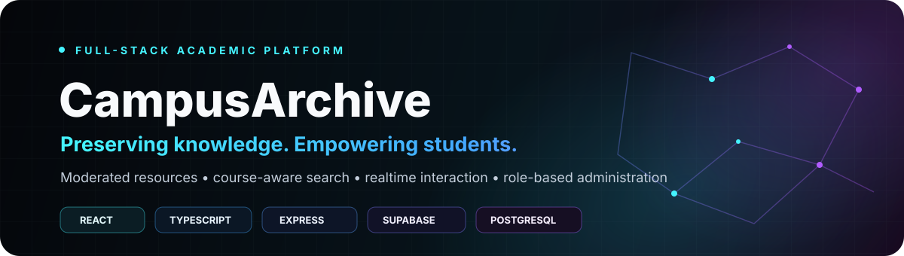
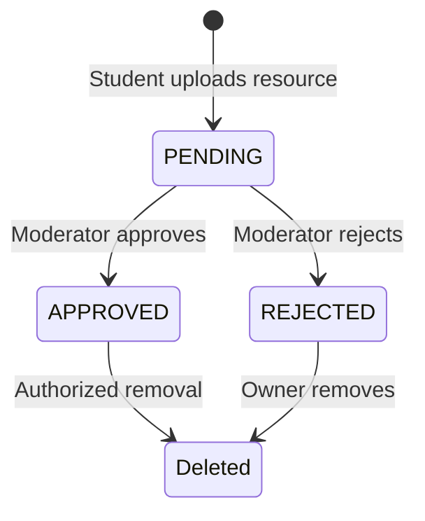
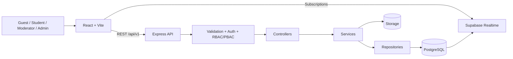

<div align="center">



[](#technology-stack)
[](#technology-stack)
[](#technology-stack)
[](#technology-stack)
[](#technology-stack)
[](./.github/workflows/deploy-production.yml)

### Preserving knowledge. Empowering students.

**A production-minded academic resource platform that transforms scattered university material into a structured, searchable, moderated, and collaborative knowledge archive.**

[Architecture](./ARCHITECTURE.md) · [API specification](./API_SPECIFICATION.md) · [Roadmap](./ROADMAP.md) · [Issues](https://github.com/usman611b/CampusArchive/issues)

</div>

---

## Contents

- [About](#about)
- [Features](#features)
- [How it works](#how-it-works)
- [Roles](#roles-and-permissions)
- [Technology stack](#technology-stack)
- [Architecture](#architecture)
- [Data model](#data-model)
- [API](#api-reference)
- [Project structure](#project-structure)
- [Getting started](#getting-started)
- [Environment variables](#environment-variables)
- [Database setup](#database-setup)
- [Commands](#commands)
- [Security](#security)
- [Testing](#testing-and-verification)
- [Deployment](#production-deployment)
- [Troubleshooting](#troubleshooting)
- [Documentation](#documentation)
- [Contributing](#contributing)

## About

University notes, past papers, lab manuals, assignments, books, and project material are often scattered across chats, personal drives, and old devices. CampusArchive gives a university community one organized place to preserve, discover, verify, and discuss that knowledge.

Every resource lives inside a real academic hierarchy:

```text
Department
└── Program
    └── Semester
        └── Course
            ├── Chapter (optional)
            └── Resource
```

CampusArchive is more than a file upload screen. It combines content lifecycle management, moderation, search, storage, realtime interactions, role-based administration, analytics, and production delivery in one full-stack TypeScript system.

## Features

### Student experience

- Responsive landing page with live platform statistics.
- Academic exploration by department, program, semester, course, and chapter.
- Course Hubs with resources, discussions, and contributor rankings.
- Global search with category, department, semester, and sort filters.
- Detailed resource pages with metadata, uploader, tags, analytics, ratings, comments, and related resources.
- Seven-step guided upload workflow backed by Supabase Storage.
- Personal upload history with moderation status.
- Persistent bookmarks and saved-resource library.
- Profile, contribution karma, dashboard, and notifications.
- Light/dark themes and a responsive application shell.
- Contact and support-request workflow.

### Community interactions

- One 1–5 star rating per user/resource, with update and delete behavior.
- Comments and nested replies up to three levels.
- Comment editing, soft deletion, likes, and moderator locking.
- Views, downloads, bookmarks, and related-resource discovery.
- Supabase Realtime synchronization for persisted interaction changes.

### Moderation and administration

- Pending-resource moderation queue.
- Approve, reject, feature, or remove resources.
- Search users and manage roles or account state.
- Suspend, restore, and soft-delete accounts according to permissions.
- Platform analytics and contributor leaderboard.
- System announcements, support-request management, and audit logs.

## How it works



1. The frontend requests a signed upload URL.
2. The file is uploaded to the `academic_resources` Supabase Storage bucket.
3. The API stores metadata, academic relationships, tags, owner, path, and checksum.
4. New content begins in `PENDING` state.
5. Approved content becomes available in search, Course Hubs, dashboards, and related results.
6. Ratings, comments, likes, bookmarks, views, and downloads are persisted through the API.
7. Realtime events tell connected clients to reload authoritative state.

## Roles and permissions

| Role | Capabilities |
|---|---|
| **Guest** | Browse approved resources, explore academics, search, and read public interactions |
| **Student** | Upload, download, bookmark, rate, discuss, manage personal content, and receive notifications |
| **Moderator** | Review resources, moderate interactions, feature content, and lock discussions where permitted |
| **Administrator** | Manage users, analytics, moderation, announcements, support requests, and audit logs |
| **Super Administrator** | Complete privileged administration, including sensitive account operations |

Authorization is enforced by the backend. Frontend visibility is never treated as a security boundary.

## Technology stack

| Layer | Technology |
|---|---|
| Frontend | React 18, TypeScript, Vite, React Router |
| UI | Tailwind CSS, Framer Motion, Lucide React |
| API | Node.js, Express, TypeScript, Zod |
| Authentication | Application JWT and bcrypt |
| Database | Supabase PostgreSQL |
| Storage | Supabase Storage with signed URLs |
| Realtime | Supabase Realtime / Postgres Changes |
| Security | Helmet, CORS allowlist, rate limits, sanitization, RLS |
| Logging/cache | Pino, Pino HTTP, NodeCache |
| Monorepo | npm workspaces and a shared TypeScript package |
| Operations | PM2, Nginx, GitHub Actions, AWS OIDC and SSM |

## Architecture



Backend requests follow:

```text
Route → Middleware → Controller → Service → Repository / Supabase
```

Key decisions:

- Moderation is part of the data model, not a cosmetic screen.
- Academic context is built into retrieval.
- The backend is authoritative for access and interaction state.
- Realtime synchronizes clients but does not replace persistence.
- Privileged actions remain permission-aware and auditable.

## Data model

| Domain | Tables |
|---|---|
| Academic | `departments`, `programs`, `semesters`, `courses`, `chapters`, `categories`, `tags`, `resource_tags` |
| Users | `users`, `contributor_metrics`, `notifications`, `audit_logs` |
| Resources | `resources`, `storage_metadata`, `resource_analytics`, `downloads`, `views`, `bookmarks` |
| Interactions | `resource_ratings`, `resource_comments`, `comment_likes` |
| Moderation/support | `reports`, `moderation_logs`, `contact_requests` |

The schema includes foreign keys, constraints, indexes, triggers, and Row Level Security. See [`backend/database/schema.sql`](./backend/database/schema.sql) and [`DATABASE_DESIGN.md`](./DATABASE_DESIGN.md).

## API reference

Base URL: `http://localhost:4000/api/v1`

Health check: `GET http://localhost:4000/health`

Protected requests use `Authorization: Bearer <access-token>`.

| Domain | Main endpoints |
|---|---|
| Auth | `POST /auth/register`, `POST /auth/login`, `GET /auth/me`, `PUT /auth/profile`, `PATCH /auth/password`, `DELETE /auth/me` |
| Academics | Departments, programs, semesters, courses, Course Hubs, and contributors under `/academics` |
| Resources | Upload URL, create, personal uploads, course resources/discussions, details, downloads, bookmarks, ratings, and deletion under `/resources` |
| Interactions | Rating and comment CRUD, comment likes, discussion locks, and public interaction reads |
| Search | Resource search plus categories and department filter metadata under `/search` |
| Personal | Bookmarks and notification read/clear operations |
| Dashboard | Dashboard statistics and contributor leaderboard |
| Contact | Public rate-limited support submission at `POST /contact` |
| Admin | Analytics, moderation, resources, users, audit logs, contacts, and announcements under `/admin` |

For endpoint details and response contracts, read [`API_SPECIFICATION.md`](./API_SPECIFICATION.md).

## Project structure

```text
CampusArchive/
├── .github/workflows/       # Security, build, and deployment workflow
├── backend/
│   ├── database/            # Schema, migrations, and seed data
│   ├── scripts/             # Maintenance and E2E verification
│   └── src/
│       ├── config/          # Environment, Supabase, and logging
│       ├── controllers/     # HTTP handlers
│       ├── dtos/            # Stable response mappings
│       ├── middlewares/     # Auth, permissions, validation, errors
│       ├── repositories/    # Persistence operations
│       ├── routes/          # REST domains
│       ├── services/        # Application rules
│       └── validators/      # Zod schemas
├── deploy/nginx/            # Production security headers
├── docs/                    # Product and engineering documentation
├── frontend/src/
│   ├── components/          # UI, layout, home, and resource components
│   ├── context/             # Auth, theme, and toast state
│   ├── pages/               # Product views
│   ├── router/              # Protected routing
│   ├── services/            # API and Supabase clients
│   └── types/               # Frontend domain types
├── scripts/                 # Production deployment
├── shared/                  # Shared TypeScript contracts
└── package.json             # Workspace commands
```

## Getting started

### Prerequisites

- Node.js 20+ (CI uses Node.js 22)
- npm 10+
- A Supabase project
- A Supabase Storage bucket named `academic_resources`

### Install and run

```bash
git clone https://github.com/usman611b/CampusArchive.git
cd CampusArchive
npm install
cp frontend/.env.example frontend/.env
cp backend/.env.example backend/.env
npm run dev
```

PowerShell environment-file commands:

```powershell
Copy-Item frontend/.env.example frontend/.env
Copy-Item backend/.env.example backend/.env
```

| Service | URL |
|---|---|
| Frontend | `http://localhost:5173` |
| API | `http://localhost:4000/api/v1` |
| Health | `http://localhost:4000/health` |

## Environment variables

### Frontend

| Variable | Description |
|---|---|
| `VITE_API_BASE_URL` | Express API base URL |
| `VITE_SUPABASE_URL` | Public Supabase project URL |
| `VITE_SUPABASE_ANON_KEY` | Public anonymous key |

### Backend

| Variable | Description |
|---|---|
| `PORT`, `NODE_ENV` | Runtime configuration |
| `CORS_ORIGIN` | Comma-separated allowed frontend origins |
| `SUPABASE_URL` | Supabase project URL |
| `SUPABASE_SERVICE_ROLE_KEY` | Server-only database/storage credential |
| `SUPABASE_JWT_SECRET`, `JWT_SECRET` | Token verification/signing secrets |
| `FIRST_ADMIN_EMAIL`, `ENABLE_FIRST_ADMIN_BOOTSTRAP` | Optional first-admin provisioning |
| `RESEND_API_KEY`, `EMAIL_FROM`, `SUPPORT_EMAIL` | Optional transactional email configuration |
| `RATE_LIMIT_WINDOW_MS`, `RATE_LIMIT_MAX_REQUESTS` | Rate-limit controls |

Never commit `.env` files. Only browser-safe values may use the `VITE_` prefix.

## Database setup

Apply these in Supabase SQL Editor:

1. [`backend/database/schema.sql`](./backend/database/schema.sql)
2. [`backend/database/20260805_resource_interactions.sql`](./backend/database/20260805_resource_interactions.sql)
3. [`backend/database/20260806_contact_support.sql`](./backend/database/20260806_contact_support.sql)
4. [`backend/database/20260806_user_suspension_compat.sql`](./backend/database/20260806_user_suspension_compat.sql)
5. [`backend/database/20260806_security_hardening.sql`](./backend/database/20260806_security_hardening.sql)
6. Optionally, [`backend/database/seed.sql`](./backend/database/seed.sql)

Create the `academic_resources` storage bucket and validate its policies before testing uploads.

## Commands

| Command | Purpose |
|---|---|
| `npm run dev` | Start frontend and backend together |
| `npm run dev:frontend` | Start Vite only |
| `npm run dev:backend` | Start Express only |
| `npm run build` | Build all workspaces |
| `npm run build:frontend` | Type-check and build the frontend |
| `npm run build:backend` | Compile the backend |
| `npm run start:backend` | Start the compiled API |

## Security

Implemented controls include bcrypt hashing, JWT authentication, ownership checks, RBAC/PBAC middleware, Zod validation, HTML sanitization, Helmet, CORS allowlisting, request/body limits, rate limiting, request IDs, RLS policies, server-only service credentials, signed storage URLs, soft deletion, audit logging, Gitleaks, and CI dependency auditing.

> [!IMPORTANT]
> Never expose `SUPABASE_SERVICE_ROLE_KEY`, `SUPABASE_JWT_SECRET`, `JWT_SECRET`, or `RESEND_API_KEY` in frontend code, logs, screenshots, issues, or commits.

Read [`docs/SECURITY.md`](./docs/SECURITY.md) and [`docs/SECURITY_AUDIT.md`](./docs/SECURITY_AUDIT.md).

## Testing and verification

```bash
npm ci
npm run build
```

CI performs secret scanning, production dependency auditing, locked installation, complete workspace compilation, and post-deployment HTTPS verification. The repository also includes [`backend/scripts/verify_e2e_flow.js`](./backend/scripts/verify_e2e_flow.js) for configured test environments.

## Production deployment

```text
Internet → HTTPS/Nginx → frontend/dist
                       └→ /api → PM2 Express cluster
                                      └→ Supabase PostgreSQL + Storage
```

On pushes to `main`, GitHub Actions scans, audits, builds, obtains temporary AWS credentials through OIDC, deploys through AWS Systems Manager, runs [`scripts/deploy-production.sh`](./scripts/deploy-production.sh), and verifies the public HTTPS endpoint.

Required environment variables include `AWS_DEPLOY_ROLE_ARN`, `AWS_REGION`, and `EC2_INSTANCE_ID`. See [`docs/DEPLOYMENT.md`](./docs/DEPLOYMENT.md).

## Troubleshooting

| Problem | Checks |
|---|---|
| Frontend cannot reach API | Check backend port, `VITE_API_BASE_URL`, `CORS_ORIGIN`, and `/health` |
| Repeated `401` | Verify JWT secrets, bearer token, and sign in again |
| Realtime not updating | Apply migrations, enable table Realtime, and check public frontend credentials |
| Upload/download failure | Check bucket, object path, policies, service key, and signed-URL expiry |
| Stale dashboard | Wait for the short analytics cache or restart the backend |
| PowerShell blocks npm | Run `npm.cmd run dev` |

## Documentation

| Document | Focus |
|---|---|
| [`PRD.md`](./PRD.md) | Product requirements |
| [`ARCHITECTURE.md`](./ARCHITECTURE.md) | System architecture |
| [`API_SPECIFICATION.md`](./API_SPECIFICATION.md) | REST API contract |
| [`BACKEND_DESIGN.md`](./BACKEND_DESIGN.md) | Backend design |
| [`FRONTEND_DESIGN.md`](./FRONTEND_DESIGN.md) | Frontend design |
| [`DATABASE_DESIGN.md`](./DATABASE_DESIGN.md) | Relational model |
| [`DESIGN_GUIDELINES.md`](./DESIGN_GUIDELINES.md) | UI conventions |
| [`DEVOPS_DESIGN.md`](./DEVOPS_DESIGN.md) | Infrastructure and delivery |
| [`ROADMAP.md`](./ROADMAP.md) | Planned evolution |
| [`docs/USER_FLOW.md`](./docs/USER_FLOW.md) | User journeys |

Planned functionality stays in the roadmap so future designs are not presented as shipped behavior.

## Contributing

1. Fork the repository.
2. Create a focused branch: `git checkout -b feature/your-feature`.
3. Make the change and update relevant documentation.
4. Run `npm run build`.
5. Commit clearly, push, and open a pull request.

Keep changes focused, explain security/product impact, include verification steps, and never commit secrets.

## Author

**Usman Ali** · [GitHub](https://github.com/usman611b) · [Portfolio](https://www.usmanalii.com/)

---

<div align="center">

### Built as a system—not a collection of screens.

If CampusArchive helps or inspires you, consider giving it a ⭐

</div>
