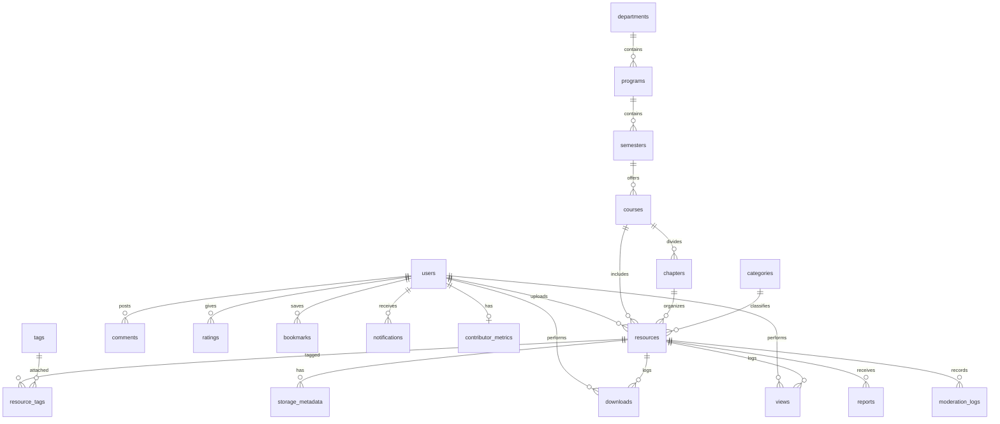
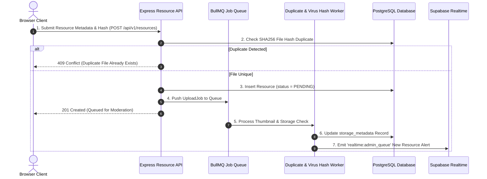

# CampusArchive — Master Enterprise Backend & Real-Time Data Blueprint

> **Architectural Paradigm**: 100% Dynamic, Fully Normalized Knowledge Platform. Zero Hardcoding. Every counter, score, card, badge, leaderboard rank, and notification is computed via Domain Services, cached in analytical tables, and delivered over REST APIs and Supabase Realtime WebSockets.

---

## 1. Domain-Driven 5-Tier System Architecture

The CampusArchive backend transitions from a simple 3-tier architecture to an **Enterprise Domain-Driven Architecture (DDD)** featuring an isolated **Domain Layer** for strict business rules.

```mermaid
flowchart TD
    subgraph Client [React Frontend + Zustand Store]
        UI[Dynamic React Views]
        WS[Supabase Realtime WebSockets]
    end

    subgraph API Router [Modular API Routers (v1 / v2)]
        DashAPI[Dashboard API]
        AcadAPI[Academics & Knowledge API]
        ResAPI[Resource & Storage API]
        CommAPI[Community & Discussion API]
        NotifAPI[Notification API]
        AdminAPI[Admin & Moderation API]
    end

    subgraph Controller Layer [HTTP Controllers]
        AuthGuard[JWT & RBAC Guard]
        ZodVal[Zod Schema Validator]
    end

    subgraph Service Layer [Application Services]
        AppServices[Orchestration Services]
    end

    subgraph Domain Layer [Domain Business Logic]
        DomainRules[Business Rules & Validators]
        KarmaCalculator[Karma Score Engine]
        DuplicateChecker[SHA256 Hash Checker]
    end

    subgraph Repo Layer [Repository Abstraction]
        PostgresRepo[Supabase Repositories]
    end

    subgraph Async Queue [Background Jobs Engine]
        Queue[Async Task Queue (Preview, Metrics, Notifications)]
    end

    subgraph Data Stores [Supabase Platform Engine]
        DB[(PostgreSQL Relational DB - 20 Tables)]
        Storage[Supabase Object Storage]
        RealtimeBus[Supabase Realtime Pub/Sub]
    end

    UI --> API Router
    API Router --> AuthGuard
    AuthGuard --> ZodVal
    ZodVal --> AppServices
    AppServices --> DomainRules
    DomainRules --> PostgresRepo
    PostgresRepo --> DB
    AppServices --> Queue
    Queue --> Storage
    Queue --> RealtimeBus
    RealtimeBus --> WS
    WS --> UI
```

---

## 2. Knowledge Asset Layer Hierarchy

CampusArchive is structured as a **Hierarchical Academic Knowledge Platform** matching how university students study:

```text
University (CampusArchive Core)
  └── Department (e.g. Computer Science & Software)
       └── Program (e.g. BS Computer Science)
            └── Semester (e.g. Semester 4)
                 └── Course (e.g. Data Structures & Algorithms)
                      └── Chapter (Optional, e.g. Chapter 5 - Binary Search Trees)
                           └── Knowledge Assets
                                ├── 📄 Notes / Slides
                                ├── 📝 Past Papers (Prof & Send-ups)
                                ├── 📋 Assignments & Rubrics
                                ├── 💻 Project Source Code
                                ├── 📚 Reference Textbooks
                                ├── 🔬 Lab / Dissection Manuals
                                ├── 🎥 Video Tutorials
                                ├── 🔗 External Web Links
                                └── 💬 Threaded Discussions & Q&A
```

---

## 3. Normalized Database Schema (20 PostgreSQL Tables)

### 3.1 ER Diagram



### 3.2 Complete PostgreSQL DDL SQL Schema

```sql
-- 1. EXTENSIONS & ENUMS
CREATE EXTENSION IF NOT EXISTS "uuid-ossp";

CREATE TYPE user_role AS ENUM ('STUDENT', 'MODERATOR', 'ADMINISTRATOR');
CREATE TYPE resource_status AS ENUM ('PENDING', 'APPROVED', 'REJECTED');
CREATE TYPE report_status AS ENUM ('PENDING', 'REVIEWED', 'RESOLVED', 'DISMISSED');
CREATE TYPE notification_type AS ENUM (
  'RESOURCE_APPROVED', 
  'RESOURCE_REJECTED', 
  'COMMENT', 
  'REPLY', 
  'MENTION', 
  'SYSTEM', 
  'ADMIN', 
  'COURSE', 
  'BADGE'
);

-- 2. DEPARTMENTS TABLE
CREATE TABLE public.departments (
    id UUID PRIMARY KEY DEFAULT uuid_generate_v4(),
    name VARCHAR(255) NOT NULL,
    slug VARCHAR(255) UNIQUE NOT NULL,
    code VARCHAR(50) NOT NULL,
    icon_name VARCHAR(100) DEFAULT 'BookOpen',
    description TEXT,
    created_at TIMESTAMP WITH TIME ZONE DEFAULT CURRENT_TIMESTAMP,
    deleted_at TIMESTAMP WITH TIME ZONE
);

-- 3. PROGRAMS TABLE
CREATE TABLE public.programs (
    id UUID PRIMARY KEY DEFAULT uuid_generate_v4(),
    department_id UUID NOT NULL REFERENCES public.departments(id) ON DELETE CASCADE,
    name VARCHAR(255) NOT NULL,
    slug VARCHAR(255) UNIQUE NOT NULL,
    code VARCHAR(50) NOT NULL,
    total_semesters INT DEFAULT 8,
    description TEXT,
    created_at TIMESTAMP WITH TIME ZONE DEFAULT CURRENT_TIMESTAMP,
    deleted_at TIMESTAMP WITH TIME ZONE
);

-- 4. SEMESTERS TABLE
CREATE TABLE public.semesters (
    id UUID PRIMARY KEY DEFAULT uuid_generate_v4(),
    program_id UUID NOT NULL REFERENCES public.programs(id) ON DELETE CASCADE,
    semester_number INT NOT NULL CHECK (semester_number BETWEEN 1 AND 10),
    title VARCHAR(100) NOT NULL,
    created_at TIMESTAMP WITH TIME ZONE DEFAULT CURRENT_TIMESTAMP,
    UNIQUE(program_id, semester_number)
);

-- 5. USERS TABLE (FULLY NORMALIZED)
CREATE TABLE public.users (
    id UUID PRIMARY KEY DEFAULT uuid_generate_v4(),
    email VARCHAR(255) UNIQUE NOT NULL,
    password_hash VARCHAR(255) NOT NULL,
    full_name VARCHAR(255) NOT NULL,
    username VARCHAR(100) UNIQUE NOT NULL,
    role user_role DEFAULT 'STUDENT',
    university_name VARCHAR(255) DEFAULT 'University Campus Archive',
    department_id UUID REFERENCES public.departments(id) ON DELETE SET NULL,
    program_id UUID REFERENCES public.programs(id) ON DELETE SET NULL,
    semester_id UUID REFERENCES public.semesters(id) ON DELETE SET NULL,
    avatar_url TEXT,
    bio TEXT,
    created_at TIMESTAMP WITH TIME ZONE DEFAULT CURRENT_TIMESTAMP,
    updated_at TIMESTAMP WITH TIME ZONE DEFAULT CURRENT_TIMESTAMP,
    deleted_at TIMESTAMP WITH TIME ZONE
);

-- 6. COURSES TABLE
CREATE TABLE public.courses (
    id UUID PRIMARY KEY DEFAULT uuid_generate_v4(),
    program_id UUID NOT NULL REFERENCES public.programs(id) ON DELETE CASCADE,
    semester_id UUID NOT NULL REFERENCES public.semesters(id) ON DELETE CASCADE,
    code VARCHAR(50) UNIQUE NOT NULL,
    title VARCHAR(255) NOT NULL,
    slug VARCHAR(255) UNIQUE NOT NULL,
    description TEXT,
    instructor_name VARCHAR(255),
    credit_hours INT DEFAULT 3,
    created_at TIMESTAMP WITH TIME ZONE DEFAULT CURRENT_TIMESTAMP,
    deleted_at TIMESTAMP WITH TIME ZONE
);

-- 7. CHAPTERS TABLE (OPTIONAL KNOWLEDGE LAYER)
CREATE TABLE public.chapters (
    id UUID PRIMARY KEY DEFAULT uuid_generate_v4(),
    course_id UUID NOT NULL REFERENCES public.courses(id) ON DELETE CASCADE,
    chapter_no INT NOT NULL,
    title VARCHAR(255) NOT NULL,
    description TEXT,
    created_at TIMESTAMP WITH TIME ZONE DEFAULT CURRENT_TIMESTAMP,
    UNIQUE(course_id, chapter_no)
);

-- 8. CATEGORIES TABLE
CREATE TABLE public.categories (
    id UUID PRIMARY KEY DEFAULT uuid_generate_v4(),
    name VARCHAR(100) NOT NULL,
    slug VARCHAR(100) UNIQUE NOT NULL,
    icon VARCHAR(100) NOT NULL,
    color VARCHAR(50) NOT NULL,
    display_order INT DEFAULT 0,
    created_at TIMESTAMP WITH TIME ZONE DEFAULT CURRENT_TIMESTAMP
);

-- 9. RESOURCES TABLE
CREATE TABLE public.resources (
    id UUID PRIMARY KEY DEFAULT uuid_generate_v4(),
    uploader_id UUID NOT NULL REFERENCES public.users(id) ON DELETE CASCADE,
    course_id UUID NOT NULL REFERENCES public.courses(id) ON DELETE CASCADE,
    chapter_id UUID REFERENCES public.chapters(id) ON DELETE SET NULL,
    category_id UUID NOT NULL REFERENCES public.categories(id) ON DELETE RESTRICT,
    title VARCHAR(255) NOT NULL,
    description TEXT NOT NULL,
    file_storage_path TEXT NOT NULL,
    file_hash VARCHAR(64) UNIQUE NOT NULL, -- SHA256 Hash Duplicate Detection
    version VARCHAR(20) DEFAULT '1.0',
    status resource_status DEFAULT 'PENDING',
    created_at TIMESTAMP WITH TIME ZONE DEFAULT CURRENT_TIMESTAMP,
    updated_at TIMESTAMP WITH TIME ZONE DEFAULT CURRENT_TIMESTAMP,
    deleted_at TIMESTAMP WITH TIME ZONE,
    deleted_by UUID REFERENCES public.users(id)
);

-- 10. STORAGE METADATA TABLE
CREATE TABLE public.storage_metadata (
    id UUID PRIMARY KEY DEFAULT uuid_generate_v4(),
    resource_id UUID UNIQUE NOT NULL REFERENCES public.resources(id) ON DELETE CASCADE,
    file_hash VARCHAR(64) UNIQUE NOT NULL,
    mime_type VARCHAR(100) NOT NULL,
    file_size_bytes BIGINT NOT NULL,
    checksum VARCHAR(64),
    virus_scan_status VARCHAR(50) DEFAULT 'PASSED',
    preview_url TEXT,
    thumbnail_url TEXT,
    created_at TIMESTAMP WITH TIME ZONE DEFAULT CURRENT_TIMESTAMP
);

-- 11. TAGS TABLE
CREATE TABLE public.tags (
    id UUID PRIMARY KEY DEFAULT uuid_generate_v4(),
    name VARCHAR(50) UNIQUE NOT NULL,
    slug VARCHAR(50) UNIQUE NOT NULL,
    created_at TIMESTAMP WITH TIME ZONE DEFAULT CURRENT_TIMESTAMP
);

-- 12. RESOURCE_TAGS (MANY-TO-MANY)
CREATE TABLE public.resource_tags (
    resource_id UUID NOT NULL REFERENCES public.resources(id) ON DELETE CASCADE,
    tag_id UUID NOT NULL REFERENCES public.tags(id) ON DELETE CASCADE,
    PRIMARY KEY (resource_id, tag_id)
);

-- 13. DOWNLOADS HISTORY TABLE
CREATE TABLE public.downloads (
    id UUID PRIMARY KEY DEFAULT uuid_generate_v4(),
    resource_id UUID NOT NULL REFERENCES public.resources(id) ON DELETE CASCADE,
    user_id UUID REFERENCES public.users(id) ON DELETE SET NULL,
    downloaded_at TIMESTAMP WITH TIME ZONE DEFAULT CURRENT_TIMESTAMP,
    ip_address VARCHAR(45),
    device_info TEXT
);

-- 14. VIEWS HISTORY TABLE
CREATE TABLE public.views (
    id UUID PRIMARY KEY DEFAULT uuid_generate_v4(),
    resource_id UUID NOT NULL REFERENCES public.resources(id) ON DELETE CASCADE,
    user_id UUID REFERENCES public.users(id) ON DELETE SET NULL,
    viewed_at TIMESTAMP WITH TIME ZONE DEFAULT CURRENT_TIMESTAMP,
    ip_address VARCHAR(45)
);

-- 15. COMMENTS / Q&A TABLE
CREATE TABLE public.comments (
    id UUID PRIMARY KEY DEFAULT uuid_generate_v4(),
    resource_id UUID REFERENCES public.resources(id) ON DELETE CASCADE,
    course_id UUID REFERENCES public.courses(id) ON DELETE CASCADE,
    user_id UUID NOT NULL REFERENCES public.users(id) ON DELETE CASCADE,
    parent_comment_id UUID REFERENCES public.comments(id) ON DELETE CASCADE,
    content TEXT NOT NULL,
    is_helpful_count INT DEFAULT 0,
    created_at TIMESTAMP WITH TIME ZONE DEFAULT CURRENT_TIMESTAMP,
    deleted_at TIMESTAMP WITH TIME ZONE
);

-- 16. RATINGS TABLE
CREATE TABLE public.ratings (
    id UUID PRIMARY KEY DEFAULT uuid_generate_v4(),
    resource_id UUID NOT NULL REFERENCES public.resources(id) ON DELETE CASCADE,
    user_id UUID NOT NULL REFERENCES public.users(id) ON DELETE CASCADE,
    stars INT NOT NULL CHECK (stars BETWEEN 1 AND 5),
    review_text TEXT,
    created_at TIMESTAMP WITH TIME ZONE DEFAULT CURRENT_TIMESTAMP,
    UNIQUE(resource_id, user_id)
);

-- 17. BOOKMARKS TABLE
CREATE TABLE public.bookmarks (
    id UUID PRIMARY KEY DEFAULT uuid_generate_v4(),
    user_id UUID NOT NULL REFERENCES public.users(id) ON DELETE CASCADE,
    resource_id UUID NOT NULL REFERENCES public.resources(id) ON DELETE CASCADE,
    created_at TIMESTAMP WITH TIME ZONE DEFAULT CURRENT_TIMESTAMP,
    UNIQUE(user_id, resource_id)
);

-- 18. NOTIFICATIONS TABLE
CREATE TABLE public.notifications (
    id UUID PRIMARY KEY DEFAULT uuid_generate_v4(),
    user_id UUID NOT NULL REFERENCES public.users(id) ON DELETE CASCADE,
    actor_id UUID REFERENCES public.users(id) ON DELETE SET NULL,
    type notification_type NOT NULL,
    title VARCHAR(255) NOT NULL,
    description TEXT NOT NULL,
    is_read BOOLEAN DEFAULT FALSE,
    created_at TIMESTAMP WITH TIME ZONE DEFAULT CURRENT_TIMESTAMP
);

-- 19. CONTRIBUTOR METRICS TABLE (DECOUPLED ANALYTICS)
CREATE TABLE public.contributor_metrics (
    user_id UUID PRIMARY KEY REFERENCES public.users(id) ON DELETE CASCADE,
    uploads_count INT DEFAULT 0,
    downloads_count INT DEFAULT 0,
    avg_rating DECIMAL(3,2) DEFAULT 0.00,
    bookmarks_count INT DEFAULT 0,
    helpful_comments_count INT DEFAULT 0,
    karma_score INT DEFAULT 0,
    last_calculated_at TIMESTAMP WITH TIME ZONE DEFAULT CURRENT_TIMESTAMP
);

-- 20. RESOURCE ANALYTICS TABLE
CREATE TABLE public.resource_analytics (
    resource_id UUID PRIMARY KEY REFERENCES public.resources(id) ON DELETE CASCADE,
    views_count INT DEFAULT 0,
    downloads_count INT DEFAULT 0,
    shares_count INT DEFAULT 0,
    bookmarks_count INT DEFAULT 0,
    comments_count INT DEFAULT 0,
    rating_avg DECIMAL(3,2) DEFAULT 0.00,
    updated_at TIMESTAMP WITH TIME ZONE DEFAULT CURRENT_TIMESTAMP
);

-- 21. REPORTS & MODERATION LOGS
CREATE TABLE public.reports (
    id UUID PRIMARY KEY DEFAULT uuid_generate_v4(),
    resource_id UUID NOT NULL REFERENCES public.resources(id) ON DELETE CASCADE,
    reporter_id UUID NOT NULL REFERENCES public.users(id) ON DELETE CASCADE,
    reason TEXT NOT NULL,
    status report_status DEFAULT 'PENDING',
    created_at TIMESTAMP WITH TIME ZONE DEFAULT CURRENT_TIMESTAMP
);

CREATE TABLE public.moderation_logs (
    id UUID PRIMARY KEY DEFAULT uuid_generate_v4(),
    resource_id UUID NOT NULL REFERENCES public.resources(id) ON DELETE CASCADE,
    admin_id UUID NOT NULL REFERENCES public.users(id) ON DELETE CASCADE,
    action VARCHAR(50) NOT NULL,
    reason TEXT,
    created_at TIMESTAMP WITH TIME ZONE DEFAULT CURRENT_TIMESTAMP
);

-- INDEXES FOR HIGH-SPEED QUERY PERFORMANCE
CREATE INDEX idx_resources_course ON public.resources(course_id);
CREATE INDEX idx_resources_status ON public.resources(status);
CREATE INDEX idx_resources_file_hash ON public.resources(file_hash);
CREATE INDEX idx_downloads_resource ON public.downloads(resource_id);
CREATE INDEX idx_views_resource ON public.views(resource_id);
CREATE INDEX idx_comments_resource ON public.comments(resource_id);
CREATE INDEX idx_notifications_user_read ON public.notifications(user_id, is_read);
```

---

## 4. Analytical Algorithms & Background Job Architecture

### 4.1 Contributor Karma Score Calculation Engine
Executed in background worker jobs upon resource download, rating, or comment:

```typescript
export class KarmaCalculator {
  static computeKarmaScore(metrics: {
    uploadsCount: number;
    downloadsCount: number;
    avgRating: number;
    bookmarksCount: number;
    helpfulCommentsCount: number;
  }): number {
    return (
      metrics.uploadsCount * 50 +
      metrics.downloadsCount * 2 +
      Math.round(metrics.avgRating * 100) +
      metrics.bookmarksCount * 5 +
      metrics.helpfulCommentsCount * 10
    );
  }
}
```

### 4.2 Async Job Queue Pipeline (Upload Lifecycle)



---

## 5. Domain-Driven Backend Directory Structure

```text
f:\CampusArchive\backend\
├── src/
│   ├── config/
│   │   ├── env.ts                 # Validated Environment Config (Zod)
│   │   ├── database.ts            # Supabase PostgreSQL Pool
│   │   └── logger.ts              # Pino Logger with Trace ID
│   ├── api/
│   │   ├── v1/                    # API Version 1 Routers
│   │   │   ├── dashboard.router.ts
│   │   │   ├── academics.router.ts
│   │   │   ├── resources.router.ts
│   │   │   ├── community.router.ts
│   │   │   ├── analytics.router.ts
│   │   │   ├── notifications.router.ts
│   │   │   ├── search.router.ts
│   │   │   ├── profile.router.ts
│   │   │   └── admin.router.ts
│   │   └── v2/                    # Future Version 2 Extension Slot
│   ├── controllers/               # HTTP Request/Response Handlers
│   ├── domain/                    # Pure Business Logic & Domain Models
│   │   ├── karma.domain.ts        # Contributor Score Rules
│   │   ├── duplicate.domain.ts    # SHA256 Hash Verification
│   │   └── trending.domain.ts     # Resource & Course Ranking Rules
│   ├── services/                  # Application Orchestration Layer
│   ├── repositories/              # Supabase Database Queries
│   ├── jobs/                      # Background Queue Workers (BullMQ)
│   │   ├── uploadProcessor.job.ts
│   │   ├── karmaRecalculator.job.ts
│   │   └── thumbnailGenerator.job.ts
│   ├── middlewares/
│   │   ├── auth.middleware.ts     # JWT Validation & RBAC Guard
│   │   ├── validate.middleware.ts # Zod Schema Validator
│   │   ├── logger.middleware.ts   # Request Trace ID Tracking
│   │   └── error.middleware.ts    # Global Error Handler
│   ├── realtime/
│   │   └── supabaseRealtime.ts    # Supabase WebSockets Broadcaster
│   └── server.ts                  # HTTP Server Entrypoint
├── package.json
└── tsconfig.json
```

---

## 6. Summary of Architectural Verification

| Feature Requirement | Database Table / Service Implementation | Verification |
| :--- | :--- | :--- |
| **Normalized Users Table** | `users.program_id`, `users.semester_id`, `users.department_id` | ✅ Fully Relational |
| **Semester Table** | `public.semesters` (`program_id`, `semester_number`) | ✅ Hierarchical |
| **Category Table** | `public.categories` (`name`, `slug`, `icon`, `color`) | ✅ Normalized |
| **Many-to-Many Tags** | `public.tags` + `public.resource_tags` | ✅ Multi-Tag Search |
| **Chapter Table** | `public.chapters` (`course_id`, `chapter_no`, `title`) | ✅ Knowledge Asset Unit |
| **Duplicate Prevention** | `resources.file_hash` (`SHA256` Unique Constraint) | ✅ Zero Duplicate Files |
| **Download & View History** | `public.downloads` & `public.views` | ✅ Full Audit Trail |
| **Contributor Metrics** | `public.contributor_metrics` | ✅ Analytical Decoupling |
| **Domain Layer** | `src/domain/` Domain Rules & Validators | ✅ Clean Architecture |
