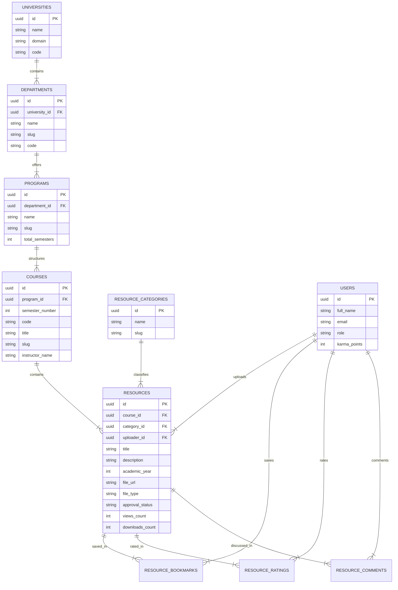

# CampusArchive: Database Design & ERD Specification
**Database Engine:** PostgreSQL 15+ / Supabase Relational Database

---

## 1. Entity Relationship Diagram (Mermaid)



---

## 2. Core SQL Schema Definition

```sql
CREATE TABLE universities (
    id UUID PRIMARY KEY DEFAULT gen_random_uuid(),
    name VARCHAR(255) NOT NULL,
    domain VARCHAR(100) UNIQUE NOT NULL,
    code VARCHAR(50) UNIQUE NOT NULL
);

CREATE TABLE departments (
    id UUID PRIMARY KEY DEFAULT gen_random_uuid(),
    university_id UUID NOT NULL REFERENCES universities(id) ON DELETE CASCADE,
    name VARCHAR(255) NOT NULL,
    slug VARCHAR(100) NOT NULL,
    code VARCHAR(20) NOT NULL,
    UNIQUE(university_id, slug)
);

CREATE TABLE programs (
    id UUID PRIMARY KEY DEFAULT gen_random_uuid(),
    department_id UUID NOT NULL REFERENCES departments(id) ON DELETE CASCADE,
    name VARCHAR(255) NOT NULL,
    slug VARCHAR(100) NOT NULL,
    total_semesters INT DEFAULT 8
);

CREATE TABLE courses (
    id UUID PRIMARY KEY DEFAULT gen_random_uuid(),
    program_id UUID NOT NULL REFERENCES programs(id) ON DELETE CASCADE,
    semester_number INT NOT NULL CHECK (semester_number BETWEEN 1 AND 12),
    code VARCHAR(50) NOT NULL,
    title VARCHAR(255) NOT NULL,
    slug VARCHAR(100) NOT NULL,
    instructor_name VARCHAR(255),
    UNIQUE(program_id, code)
);

CREATE TABLE resource_categories (
    id UUID PRIMARY KEY DEFAULT gen_random_uuid(),
    name VARCHAR(100) UNIQUE NOT NULL,
    slug VARCHAR(100) UNIQUE NOT NULL
);

CREATE TABLE resources (
    id UUID PRIMARY KEY DEFAULT gen_random_uuid(),
    course_id UUID NOT NULL REFERENCES courses(id) ON DELETE CASCADE,
    category_id UUID NOT NULL REFERENCES resource_categories(id),
    uploader_id UUID NOT NULL REFERENCES users(id) ON DELETE CASCADE,
    title VARCHAR(255) NOT NULL,
    description TEXT NOT NULL,
    academic_year INT NOT NULL,
    file_url TEXT NOT NULL,
    file_type VARCHAR(50) NOT NULL,
    file_key VARCHAR(500) NOT NULL,
    tags TEXT[] DEFAULT '{}',
    approval_status VARCHAR(20) DEFAULT 'PENDING' CHECK (approval_status IN ('PENDING', 'APPROVED', 'REJECTED')),
    views_count INT DEFAULT 0,
    downloads_count INT DEFAULT 0,
    created_at TIMESTAMP WITH TIME ZONE DEFAULT CURRENT_TIMESTAMP
);
```
